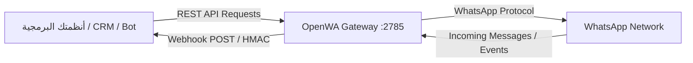

# 🚀 OpenWA - الدليل الشامل والتوثيق الاحترافي للربط البرمجي (API Integration Guide)

> **الإصدار:** 1.0.0 (Production-Ready)  
> **البروتوكول:** RESTful API + Webhooks + WebSockets  
> **صيغة البيانات:** JSON (UTF-8)  
> **العنوان الافتراضي للـ API (Base URL):** `http://localhost:2785/api`  
> **لوحة التحكم المدمجة (Single Service Mode):** `http://localhost:2785/`  
> **لوحة التحكم المخصصة (Traefik Mode):** `http://localhost:2886`  
> **وثائق Swagger التفاعلية:** `http://localhost:2785/api/docs`  
> **فحص الجاهزية والخدمة:** `http://localhost:2785/api/health/ready`  

---

## 📑 فهرس المحتويات
1. [المعمارية ونظرة عامة](#1-المعمارية-ونظرة-عامة)
2. [المصادقة والأمان (Authentication)](#2-المصادقة-والأمان-authentication)
3. [إدارة الجلسات والربط بالواتساب (Session Lifecycle)](#3-إدارة-الجلسات-والربط-بالواتساب-session-lifecycle)
4. [دليل إرسال الرسائل بجميع الأنواع (Messaging API)](#4-دليل-إرسال-الرسائل-بجميع-الأنواع-messaging-api)
   - [إرسال رسالة نصية](#41-إرسال-رسالة-نصية-send-text)
   - [إرسال الصور والفيديوهات والملفات الصوتية والمستندات](#42-إرسال-الوسائط-صور-فيديو-صوت-مستندات)
   - [إرسال موقع جغرافي (Location)](#43-إرسال-موقع-جغرافي-location)
   - [إرسال بطاقة جهة اتصال (Contact Card / vCard)](#44-إرسال-بطاقة-جهة-اتصال-contact-card)
   - [إرسال الملصقات (Stickers)](#45-إرسال-ملصق-sticker)
   - [الرد على رسالة واقتباسها (Reply)](#46-الرد-على-رسالة-محددة-reply)
   - [توجيه رسالة (Forward)](#47-توجيه-رسالة-forward)
   - [التفاعل بالإيموجي (Reactions)](#48-التفاعل-بالإيموجي-reactions)
   - [حذف رسالة (Delete Message)](#49-حذف-رسالة-delete)
   - [الإرسال الجماعي الذكي (Bulk Messaging Queue)](#410-الإرسال-الجماعي-الذكي-bulk-messaging)
5. [منظومة التحقق المتقدمة (OTP Enterprise Gateway)](#5-منظومة-التحقق-المتقدمة-otp-enterprise-gateway)
6. [استقبال الرسائل والأحداث عبر الويب هوك (Webhooks)](#6-استقبال-الرسائل-والأحداث-عبر-الويب-هوك-webhooks)
   - [تسجيل رابط الويب هوك](#61-تسجيل-رابط-الويب-هوك)
   - [هيكل حمولة الرسائل الواردة (Incoming Payload)](#62-هيكل-بيانات-الرسائل-الواردة)
   - [التحقق من توقيع الأمان (HMAC-SHA256 Signature Verification)](#63-التحقق-من-توقيع-الأمان-hmac-sha256)
7. [إدارة جهات الاتصال والمجموعات (Contacts & Groups)](#7-إدارة-جهات-الاتصال-والمجموعات-contacts--groups)
   - [التحقق من وجود رقم في الواتساب](#71-التحقق-من-وجود-رقم-في-الواتساب)
   - [إدارة المجموعات (إنشاء، إضافة، طرد، ترقية)](#72-إدارة-المجموعات)
8. [سيناريوهات ربط متكاملة (End-to-End Scenarios)](#8-سيناريوهات-ربط-متكاملة-end-to-end-scenarios)
   - [السيناريو الأول: روبوت محادثة ذكي وتفاعلي (AI Chatbot)](#السيناريو-الأول-روبوت-محادثة-ذكي-وتفاعلي-ai-chatbot)
   - [السيناريو الثاني: إرسال فواتير وإشعارات نظام ERP / CRM](#السيناريو-الثاني-إرسال-فواتير-وإشعارات-نظام-erp--crm)
8. [أمثلة برمجية بجميع اللغات (SDKs & Code Samples)](#8-أمثلة-برمجية-بجميع-اللغات)
   - [Python (requests / FastAPI)](#python)
   - [Node.js / TypeScript (Axios / Express)](#nodejs--javascript)
   - [PHP (cURL / Laravel)](#php)
   - [C# / .NET (HttpClient)](#c--net)
9. [رموز الأخطاء والاستجابة (Error Handling)](#9-رموز-الأخطاء-والاستجابة-error-handling)

---

## 1. المعمارية ونظرة عامة

يعمل نظام **OpenWA** كبوابة وسيطة فائقة الأداء (WhatsApp API Gateway) تربط بين أنظمتك البرمجية (CRMs, ERPs, Chatbots, Websites) وتطبيق الواتساب عبر واجهات REST API معيارية وأحداث فورية (Webhooks).



### صيغة معرف المحادثة (`chatId`):
* **للأرقام الفردية:** الرقم مسبوقاً برمز الدولة وبدون أي أصفار أو علامة `+` متبوعاً بـ `@c.us` (مثال: `967775451608@c.us` أو `966501234567@c.us`). *(يدعم النظام أيضاً تمرير الرقم الصافي وسيقوم بتحويله آلياً)*.
* **للمجموعات:** معرف المجموعة متبوعاً بـ `@g.us` (مثال: `120363404822161244@g.us`).
* **للقنوات:** معرف القناة متبوعاً بـ `@newsletter`.

---

## 2. المصادقة والأمان (Authentication)

تتم حماية جميع نقاط النهاية (Endpoints) باستخدام مفتاح API يُرسل في رأس الطلب (Header):

```http
X-API-Key: dev-admin-key
Content-Type: application/json
```

### التحقق من صلاحية المفتاح:
```http
POST /api/auth/validate
Headers:
  X-API-Key: dev-admin-key
```
**الرد الناجح:**
```json
{
  "valid": true,
  "role": "admin"
}
```

---

## 3. إدارة الجلسات والربط بالواتساب (Session Lifecycle)

### 3.1 إنشاء جلسة جديدة (Create Session)
```http
POST /api/sessions
Headers:
  X-API-Key: dev-admin-key
  Content-Type: application/json

{
  "name": "sales-bot"
}
```
**الرد:**
```json
{
  "id": "2904a7ee-3af1-4963-8dcb-4bfc1f5cd6e9",
  "name": "sales-bot",
  "status": "disconnected",
  "createdAt": "2026-08-16T21:00:00.000Z"
}
```

---

### 3.2 بدء الجلسة وتشغيل المحرك (Start Session)
يقوم هذا الأمر بتشغيل محرك الواتساب وتجهيز رمز الاستجابة السريعة (QR Code) أو استعادة الاتصال تلقائياً إذا كانت الجلسة مسجلة مسبقاً.

```http
POST /api/sessions/2904a7ee-3af1-4963-8dcb-4bfc1f5cd6e9/start
Headers:
  X-API-Key: dev-admin-key
```

---

### 3.3 الحصول على رمز QR لربط الحساب (Get QR Code)
```http
GET /api/sessions/2904a7ee-3af1-4963-8dcb-4bfc1f5cd6e9/qr
Headers:
  X-API-Key: dev-admin-key
```
**الرد:**
```json
{
  "qr": "data:image/png;base64,iVBORw0KGgoAAAANSUhEUgAA...",
  "status": "scan_qr"
}
```

---

### 3.4 فحص حالة الجلسة (Check Session Status)
```http
GET /api/sessions/2904a7ee-3af1-4963-8dcb-4bfc1f5cd6e9
Headers:
  X-API-Key: dev-admin-key
```
**الرد:**
```json
{
  "id": "2904a7ee-3af1-4963-8dcb-4bfc1f5cd6e9",
  "name": "sales-bot",
  "status": "ready",
  "phone": "967775451608",
  "pushName": "المهندس/محمد الشبلي",
  "connectedAt": "2026-08-16T21:47:38.656Z",
  "lastActive": "2026-08-16T21:59:30.000Z"
}
```

> **حالات الجلسة الممكنة (`status`):**
> * `disconnected`: الجلسة متوقفة.
> * `initializing`: جاري تهيئة المتصفح والمحرك.
> * `scan_qr`: بانتظار مسح كود QR من الهاتف.
> * `authenticating`: جاري التحقق واستعادة البيانات.
> * `ready`: الجلسة متصلة وجاهزة بنسبة 100% لإرسال واستقبال الرسائل.

---

### 3.5 إيقاف الجلسة (Stop Session)
```http
POST /api/sessions/2904a7ee-3af1-4963-8dcb-4bfc1f5cd6e9/stop
Headers:
  X-API-Key: dev-admin-key
```

---

## 4. دليل إرسال الرسائل بجميع الأنواع (Messaging API)

> **ملاحظة هامة:** استبدل `:sessionId` في الروابط التالية بمعرف الجلسة النشطة لديك (مثال: `2904a7ee-3af1-4963-8dcb-4bfc1f5cd6e9`).

---

### 4.1 إرسال رسالة نصية (Send Text)
```http
POST /api/sessions/:sessionId/messages/send-text
Headers:
  X-API-Key: dev-admin-key
  Content-Type: application/json

{
  "chatId": "967775451608@c.us",
  "text": "مرحباً بك! هذه رسالة تجريبية من النظام 🌟"
}
```
**الرد الناجح (201 Created):**
```json
{
  "id": "true_967775451608@c.us_3EB0C123456789",
  "timestamp": 1786906796
}
```

---

### 4.2 إرسال الوسائط (صور، فيديو، صوت، مستندات)

يدعم النظام إرسال الملفات إما عبر **رابط مباشر (Public URL)** أو عبر **Base64 String**.

#### أ. إرسال صورة (Send Image):
```http
POST /api/sessions/:sessionId/messages/send-image
Headers:
  X-API-Key: dev-admin-key
  Content-Type: application/json

{
  "chatId": "967775451608@c.us",
  "data": "https://example.com/images/invoice-banner.jpg",
  "mimetype": "image/jpeg",
  "filename": "invoice.jpg",
  "caption": "مرفق إليكم الفاتورة رقم #1024 🧾"
}
```

#### ب. إرسال ملف PDF / مستند (Send Document):
```http
POST /api/sessions/:sessionId/messages/send-document
Headers:
  X-API-Key: dev-admin-key
  Content-Type: application/json

{
  "chatId": "967775451608@c.us",
  "data": "https://example.com/files/report.pdf",
  "mimetype": "application/pdf",
  "filename": "التقرير_السنوي_2026.pdf",
  "caption": "تقرير المبيعات المعتمد 📊"
}
```

#### ج. إرسال مقطع فيديو (Send Video):
```http
POST /api/sessions/:sessionId/messages/send-video
Headers:
  X-API-Key: dev-admin-key
  Content-Type: application/json

{
  "chatId": "967775451608@c.us",
  "data": "https://example.com/videos/tutorial.mp4",
  "mimetype": "video/mp4",
  "caption": "شرح استخدام لوحة التحكم 🎬"
}
```

#### د. إرسال رسالة صوتية (Send Audio / Voice):
```http
POST /api/sessions/:sessionId/messages/send-audio
Headers:
  X-API-Key: dev-admin-key
  Content-Type: application/json

{
  "chatId": "967775451608@c.us",
  "data": "https://example.com/audio/voice-note.mp3",
  "mimetype": "audio/mp3"
}
```

---

### 4.3 إرسال موقع جغرافي (Location)
```http
POST /api/sessions/:sessionId/messages/send-location
Headers:
  X-API-Key: dev-admin-key
  Content-Type: application/json

{
  "chatId": "967775451608@c.us",
  "latitude": 15.369445,
  "longitude": 44.191006,
  "description": "موقع الشركة الرئيسي",
  "address": "صنعاء، شارع الستين"
}
```

---

### 4.4 إرسال بطاقة جهة اتصال (Contact Card)
```http
POST /api/sessions/:sessionId/messages/send-contact
Headers:
  X-API-Key: dev-admin-key
  Content-Type: application/json

{
  "chatId": "967775451608@c.us",
  "contactName": "م. محمد الشبلي",
  "contactNumber": "967775451608"
}
```

---

### 4.5 إرسال ملصق (Sticker)
```http
POST /api/sessions/:sessionId/messages/send-sticker
Headers:
  X-API-Key: dev-admin-key
  Content-Type: application/json

{
  "chatId": "967775451608@c.us",
  "data": "https://example.com/stickers/welcome.webp",
  "mimetype": "image/webp"
}
```

---

### 4.6 الرد على رسالة محددة (Reply)
```http
POST /api/sessions/:sessionId/messages/reply
Headers:
  X-API-Key: dev-admin-key
  Content-Type: application/json

{
  "chatId": "967775451608@c.us",
  "quotedMessageId": "false_967775451608@c.us_3EB0ABC1234567",
  "text": "تم استلام استفسارك وسيتم الرد عليك في أقرب وقت 👍"
}
```

---

### 4.7 توجيه رسالة (Forward)
```http
POST /api/sessions/:sessionId/messages/forward
Headers:
  X-API-Key: dev-admin-key
  Content-Type: application/json

{
  "fromChatId": "967775451608@c.us",
  "toChatId": "120363404822161244@g.us",
  "messageId": "false_967775451608@c.us_3EB0ABC1234567"
}
```

---

### 4.8 التفاعل بالإيموجي (Reactions)
```http
POST /api/sessions/:sessionId/messages/react
Headers:
  X-API-Key: dev-admin-key
  Content-Type: application/json

{
  "chatId": "967775451608@c.us",
  "messageId": "false_967775451608@c.us_3EB0ABC1234567",
  "emoji": "❤️"
}
```
*(ملاحظة: لإزالة التفاعل، أرسل قيمة `emoji` كـ نص فارغ `""`)*.

---

### 4.9 حذف رسالة (Delete)
```http
POST /api/sessions/:sessionId/messages/delete
Headers:
  X-API-Key: dev-admin-key
  Content-Type: application/json

{
  "chatId": "967775451608@c.us",
  "messageId": "true_967775451608@c.us_3EB0ABC1234567",
  "forEveryone": true
}
```

---

### 4.10 الإرسال الجماعي الذكي (Bulk Messaging)
يوفر النظام طابور مهام غير متزامن (Queue) مع حماية ذكية لتجنب حظر الأرقام (Anti-Ban Protection) من خلال ضبط فاصل زمني عشوائي بين كل رسالة.

```http
POST /api/sessions/:sessionId/messages/send-bulk
Headers:
  X-API-Key: dev-admin-key
  Content-Type: application/json

{
  "messages": [
    {
      "chatId": "967775451608@c.us",
      "text": "مرحباً عميلنا العزيز! نود تذكيركم بموعد تجديد الاشتراك 📅"
    },
    {
      "chatId": "967777000111@c.us",
      "text": "مرحباً أستاذ أحمد! نود تذكيركم بموعد تجديد الاشتراك 📅"
    }
  ],
  "options": {
    "delayBetweenMessages": 5000,
    "randomDelayVariance": 2000
  }
}
```
**الرد (202 Accepted):**
```json
{
  "batchId": "b1a45749-650a-40d8-9dbb-ec94553258a1",
  "status": "processing",
  "totalMessages": 2,
  "estimatedCompletionTime": "2026-08-16T22:30:00.000Z",
  "statusUrl": "/api/sessions/:sessionId/messages/batch/b1a45749-650a-40d8-9dbb-ec94553258a1"
}
```

#### متابعة حالة الإرسال الجماعي:
```http
GET /api/sessions/:sessionId/messages/batch/:batchId
Headers:
  X-API-Key: dev-admin-key
```

---

## 5. منظومة التحقق المتقدمة (OTP Enterprise Gateway)

يوفر النظام محركاً مستقلاً ومتطوراً لتوليد وإرسال والتحقق من رموز الـ OTP عبر واتساب مع حماية أمنية وتوجيه ذكي للجلسات.

> 📖 **للاطلاع على الدليل التخصصي الكامل:** راجع ملف [`OTP_ENTERPRISE_DOCUMENTATION.md`](file:///d:/QR/openwatest/OpenWA/OTP_ENTERPRISE_DOCUMENTATION.md)

### 5.1 إرسال رمز التحقق (Send OTP)
```http
POST /api/otp/send
Headers:
  X-API-Key: YOUR_OPENWA_API_KEY
  Content-Type: application/json

{
  "phoneNumber": "967775451608",
  "appName": "دفتري - Dafter",
  "expiresInSeconds": 300,
  "language": "ar"
}
```
**الرد الناجح:**
```json
{
  "success": true,
  "phoneNumber": "967775451608",
  "chatId": "967775451608@c.us",
  "expiresInSeconds": 300,
  "cooldownSeconds": 60,
  "message": "OTP sent successfully via WhatsApp"
}
```

---

### 5.2 التحقق من صحة الرمز (Verify OTP)
```http
POST /api/otp/verify
Headers:
  X-API-Key: YOUR_OPENWA_API_KEY
  Content-Type: application/json

{
  "phoneNumber": "967775451608",
  "code": "849201"
}
```
**الرد عند النجاح:**
```json
{
  "valid": true,
  "status": "verified",
  "message": "OTP verification succeeded.",
  "phoneNumber": "967775451608"
}
```

---

## 6. استقبال الرسائل والأحداث عبر الويب هوك (Webhooks)

تسمح لك الويب هوكس بربط أنظمتك واستقبال الرسائل الواردة فور إرسالها من العملاء، مما يتيح لك بناء شات بوت أو مزامنة فورية مع برامجك.

### 5.1 تسجيل رابط الويب هوك
```http
POST /api/sessions/:sessionId/webhooks
Headers:
  X-API-Key: dev-admin-key
  Content-Type: application/json

{
  "url": "https://api.yourdomain.com/webhooks/whatsapp",
  "events": ["message.received", "message.ack", "session.status"],
  "secret": "my-super-secure-webhook-secret",
  "retryCount": 3
}
```

---

### 5.2 هيكل بيانات الرسائل الواردة
عندما يرسل العميل رسالة، يرسل خادم OpenWA طلب `POST` فوري إلى رابطك بالهيكل التالي:

```json
{
  "event": "message.received",
  "timestamp": "2026-08-16T22:15:30.123Z",
  "sessionId": "2904a7ee-3af1-4963-8dcb-4bfc1f5cd6e9",
  "idempotencyKey": "evt_967775451608_1786906796",
  "deliveryId": "del_a1b2c3d4e5f6",
  "data": {
    "id": "false_967775451608@c.us_3EB0ABCD123456",
    "from": "967775451608@c.us",
    "to": "967775451608@c.us",
    "chatId": "967775451608@c.us",
    "body": "مرحباً، أود الاستفسار عن تفاصيل الباقة",
    "type": "chat",
    "timestamp": 1786906796,
    "fromMe": false,
    "isGroup": false,
    "media": null
  }
}
```

> **في حالة الرسائل التي تحتوي على صور أو ملفات (`hasMedia = true`):**  
> يحتوي كائن `media` على البيانات التالية:
> ```json
> "media": {
>   "mimetype": "image/jpeg",
>   "filename": "photo.jpg",
>   "data": "base64_string_here..."
> }
> ```

---

### 5.3 التحقق من توقيع الأمان (HMAC-SHA256)
إذا قمت بتعيين `secret` أثناء تسجيل الويب هوك، سيرسل خادم OpenWA التوقيع في الرأس:  
`X-OpenWA-Signature: sha256=...`

#### كود التحقق في Node.js:
```javascript
const crypto = require('crypto');

function verifyWebhookSignature(payloadString, signatureHeader, secret) {
  const hash = crypto
    .createHmac('sha256', secret)
    .update(payloadString)
    .digest('hex');
  const expectedSignature = `sha256=${hash}`;
  return crypto.timingSafeEqual(Buffer.from(expectedSignature), Buffer.from(signatureHeader));
}
```

#### كود التحقق في Python:
```python
import hmac
import hashlib

def verify_signature(payload_bytes: bytes, signature_header: str, secret: str) -> bool:
    expected_hash = hmac.new(secret.encode('utf-8'), payload_bytes, hashlib.sha256).hexdigest()
    expected_signature = f"sha256={expected_hash}"
    return hmac.compare_digest(expected_signature, signature_header)
```

---

## 6. إدارة جهات الاتصال والمجموعات (Contacts & Groups)

### 6.1 التحقق من وجود رقم في الواتساب
يساعدك هذا الإجراء في فلترة الأرقام قبل إرسال الحملات الإعلانية:
```http
GET /api/sessions/:sessionId/contacts/check/967775451608
Headers:
  X-API-Key: dev-admin-key
```
**الرد:**
```json
{
  "number": "967775451608",
  "exists": true,
  "whatsappId": "967775451608@c.us"
}
```

---

### 6.2 إدارة المجموعات

#### أ. جلب قائمة المجموعات:
```http
GET /api/sessions/:sessionId/groups
Headers:
  X-API-Key: dev-admin-key
```

#### ب. إنشاء مجموعة جديدة:
```http
POST /api/sessions/:sessionId/groups
Headers:
  X-API-Key: dev-admin-key
  Content-Type: application/json

{
  "name": "فريق الدعم الفني 🛠️",
  "participants": ["967775451608@c.us", "967777000111@c.us"]
}
```

#### ج. إضافة أعضاء لمجموعة:
```http
POST /api/sessions/:sessionId/groups/:groupId/participants
Headers:
  X-API-Key: dev-admin-key
  Content-Type: application/json

{
  "participants": ["967775451608@c.us"]
}
```

---

## 7. سيناريوهات ربط متكاملة (End-to-End Scenarios)

### السيناريو الأول: روبوت محادثة ذكي وتفاعلي (AI Chatbot)

```
1. العميل يرسل رسالة للواتساب: "مرحبا"
2. خادم OpenWA يستقبل الرسالة ويطلق حدث message.received إلى رابط الويب هوك الخاص بك.
3. خادمك يعالج النص عبر خوارزمية البوت أو نموذج ذكاء اصطناعي (مثل GPT).
4. خادمك يستدعي أمر الرد التلقائي: POST /api/sessions/:sessionId/messages/reply
5. يستلم العميل الرد فورياً على هاتفه.
```

#### مثال خادم الويب هوك الكامل (Node.js + Express):
```javascript
const express = require('express');
const axios = require('axios');

const app = express();
app.use(express.json());

const OPENWA_URL = 'http://localhost:2785/api';
const API_KEY = 'dev-admin-key';

app.post('/webhook', async (req, res) => {
  const { event, sessionId, data } = req.body;

  // نتأكد أن الحدث رسالة واردة وليست صادرة من الهاتف
  if (event === 'message.received' && !data.fromMe) {
    const sender = data.from;
    const incomingText = data.body?.trim();

    console.log(`📩 رسالة جديدة من ${sender}: ${incomingText}`);

    let replyText = 'مرحباً بك! للخدمات، أرسل رقم الخيار:\n1. مواعيد العمل\n2. التحدث مع الدعم';
    if (incomingText === '1') {
      replyText = '⏰ مواعيد العمل: من السبت إلى الخميس، 9 صباحاً - 5 مساءً.';
    } else if (incomingText === '2') {
      replyText = '👨‍💻 تم تحويل طلبك لفريق الدعم، سنتواصل معك قريباً.';
    }

    // إرسال الرد
    try {
      await axios.post(
        `${OPENWA_URL}/sessions/${sessionId}/messages/send-text`,
        { chatId: sender, text: replyText },
        { headers: { 'X-API-Key': API_KEY, 'Content-Type': 'application/json' } }
      );
    } catch (err) {
      console.error('خطأ في إرسال الرد:', err.message);
    }
  }

  res.status(200).send({ received: true });
});

app.listen(3000, () => console.log('🚀 خادم البوت يعمل على المنفذ 3000'));
```

---

### السيناريو الثاني: إرسال فواتير وإشعارات نظام ERP / CRM

عند إصدار فاتورة جديدة في نظامك، أرسل الفاتورة مع ملف PDF للعميل مباشرة:

```python
import requests

OPENWA_BASE = "http://localhost:2785/api"
SESSION_ID = "2904a7ee-3af1-4963-8dcb-4bfc1f5cd6e9"
API_KEY = "dev-admin-key"

headers = {
    "X-API-Key": API_KEY,
    "Content-Type": "application/json"
}

def send_invoice_notification(phone_number: str, customer_name: str, invoice_no: str, amount: str, pdf_url: str):
    # 1. تنظيف الرقم والتأكد من صيغة الواتساب
    clean_phone = phone_number.replace("+", "").strip()
    chat_id = f"{clean_phone}@c.us"
    
    # 2. إرسال الرسالة النصية
    msg_body = {
        "chatId": chat_id,
        "text": f"مرحباً {customer_name} 🌸\nتم إصدار فاتورتكم رقم #{invoice_no} بمبلغ {amount} ريال.\nشكراً لتعاملكم معنا!"
    }
    requests.post(f"{OPENWA_BASE}/sessions/{SESSION_ID}/messages/send-text", json=msg_body, headers=headers)
    
    # 3. إرسال ملف الفاتورة PDF
    doc_body = {
        "chatId": chat_id,
        "data": pdf_url,
        "mimetype": "application/pdf",
        "filename": f"Invoice_{invoice_no}.pdf",
        "caption": "مرفق ملف الفاتورة الضريبية 📑"
    }
    res = requests.post(f"{OPENWA_BASE}/sessions/{SESSION_ID}/messages/send-document", json=doc_body, headers=headers)
    return res.json()

# تجربة الإرسال
send_invoice_notification(
    phone_number="967775451608",
    customer_name="المهندس محمد الشبلي",
    invoice_no="INV-2026-001",
    amount="150,000",
    pdf_url="https://www.w3.org/WAI/ER/tests/xhtml/testfiles/resources/pdf/dummy.pdf"
)
```

---

## 8. أمثلة برمجية بجميع اللغات

### Python
```python
import requests

def send_whatsapp_message(session_id, to_number, message):
    url = f"http://localhost:2785/api/sessions/{session_id}/messages/send-text"
    headers = {
        "X-API-Key": "dev-admin-key",
        "Content-Type": "application/json"
    }
    payload = {
        "chatId": f"{to_number}@c.us",
        "text": message
    }
    response = requests.post(url, json=payload, headers=headers)
    return response.json()

# استدعاء
result = send_whatsapp_message("2904a7ee-3af1-4963-8dcb-4bfc1f5cd6e9", "967775451608", "مرحباً من بايثون 🐍")
print(result)
```

---

### Node.js / JavaScript
```javascript
const axios = require('axios');

async function sendWhatsAppMessage(sessionId, toNumber, message) {
  const url = `http://localhost:2785/api/sessions/${sessionId}/messages/send-text`;
  const response = await axios.post(
    url,
    {
      chatId: `${toNumber}@c.us`,
      text: message,
    },
    {
      headers: {
        'X-API-Key': 'dev-admin-key',
        'Content-Type': 'application/json',
      },
    }
  );
  return response.data;
}

sendWhatsAppMessage('2904a7ee-3af1-4963-8dcb-4bfc1f5cd6e9', '967775451608', 'مرحباً من Node.js 🚀')
  .then(console.log)
  .catch(console.error);
```

---

### PHP
```php
<?php

function sendWhatsAppMessage($sessionId, $toNumber, $message) {
    $url = "http://localhost:2785/api/sessions/{$sessionId}/messages/send-text";
    $payload = json_encode([
        "chatId" => "{$toNumber}@c.us",
        "text"   => $message
    ], JSON_UNESCAPED_UNICODE);

    $ch = curl_init($url);
    curl_setopt($ch, CURLOPT_RETURNTRANSFER, true);
    curl_setopt($ch, CURLOPT_POST, true);
    curl_setopt($ch, CURLOPT_POSTFIELDS, $payload);
    curl_setopt($ch, CURLOPT_HTTPHEADER, [
        "Content-Type: application/json; charset=utf-8",
        "X-API-Key: dev-admin-key"
    ]);

    $response = curl_exec($ch);
    curl_close($ch);
    return json_decode($response, true);
}

// تجربة الإرسال
$result = sendWhatsAppMessage("2904a7ee-3af1-4963-8dcb-4bfc1f5cd6e9", "967775451608", "مرحباً من PHP 🐘");
print_r($result);
```

---

### C# / .NET
```csharp
using System;
using System.Net.Http;
using System.Text;
using System.Text.Json;
using System.Threading.Tasks;

class Program
{
    private static readonly HttpClient client = new HttpClient();

    public static async Task SendWhatsAppMessage(string sessionId, string toNumber, string message)
    {
        var url = $"http://localhost:2785/api/sessions/{sessionId}/messages/send-text";
        
        var request = new HttpRequestMessage(HttpMethod.Post, url);
        request.Headers.Add("X-API-Key", "dev-admin-key");

        var body = new { chatId = $"{toNumber}@c.us", text = message };
        request.Content = new StringContent(JsonSerializer.Serialize(body), Encoding.UTF8, "application/json");

        var response = await client.SendAsync(request);
        var responseString = await response.Content.ReadAsStringAsync();
        Console.WriteLine(responseString);
    }
}
```

---

## 9. رموز الأخطاء والاستجابة (Error Handling)

| رمز الحالة (Status Code) | المعنى | سبب الخطأ | الإجراء المقترح |
| :--- | :--- | :--- | :--- |
| **`200 OK`** | نجاح | تم تنفيذ الطلب واسترجاع البيانات | لا يوجد |
| **`201 Created`** | تم الإرسال/الإنشاء | تم تسليم الرسالة أو إنشاء المورد بنجاح | حفظ المعرف المستلم |
| **`202 Accepted`** | قيد المعالجة | تم إدراج الحملة في طابور الإرسال الجماعي | متابعة الحالة عبر رابط `batchId` |
| **`400 Bad Request`** | طلب غير صالح | الجلسة غير متصلة، أو البيانات الممررة خاطئة | التأكد من أن الجلسة في حالة `ready` |
| **`401 Unauthorized`** | غير مصرح | مفتاح `X-API-Key` مفقود أو غير صحيح | التحقق من قيمة `X-API-Key` |
| **`404 Not Found`** | غير موجود | معرف الجلسة أو المورد غير موجود | التأكد من صحة `sessionId` |
| **`500 Server Error`** | خطأ داخلي | مشكلة في الاتصال أو محرك المتصفح | مراجعة سجلات النظام |

---

## 🎯 نصائح وإرشادات لأفضل أداء (Best Practices)
1. **تجنب حظر الأرقام (Anti-Ban):**
   * لا تقم بإرسال رسائل جماعية بمعدل يزيد عن رسالة كل 3-5 ثوانٍ.
   * استخدم ميزة الفاصل الزمني العشوائي `randomDelayVariance` المدمجة في نقطة `send-bulk`.
2. **استخدام Idempotency في الويب هوكس:**
   * تحقق دائماً من حقل `idempotencyKey` لمنع معالجة الرسالة مرتين في حال حدوث إعادة إرسال بسبب انقطاع شبكة.
3. **التأكد من جاهزية الجلسة:**
   * قبل إرسال كميات كبيرة من الرسائل، تأكد دائماً أن حالة الجلسة هي `ready`.

---

**🎉 تم إعداد هذا التوثيق ليكون مرجعاً معتمداً ومتكاملاً لجميع فرق التطوير والربط مع أنظمة الشركات.**
