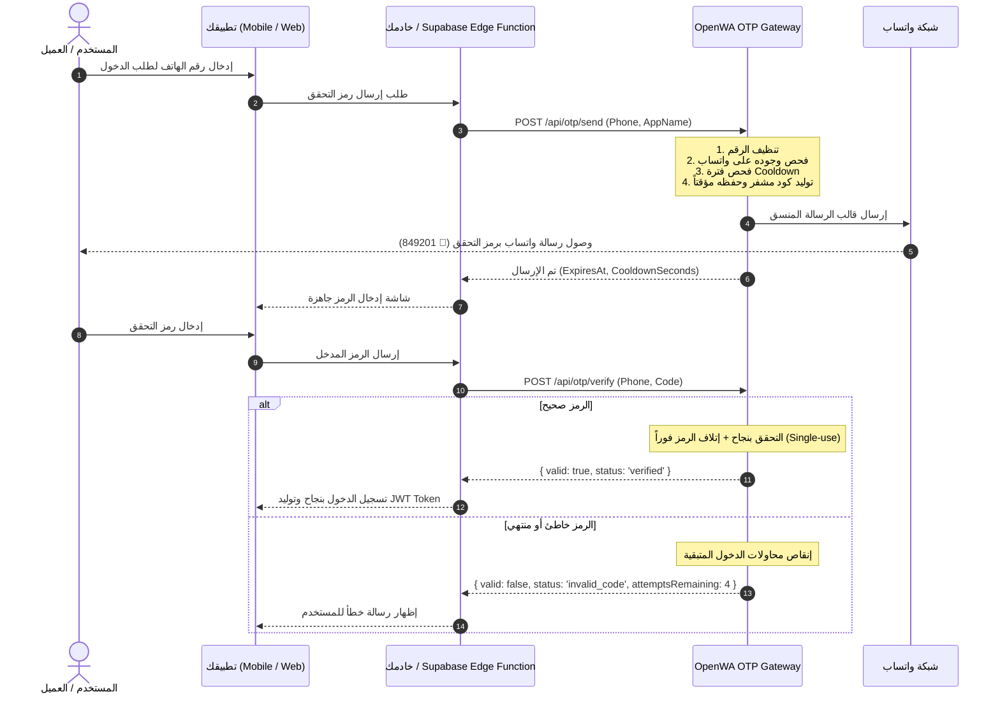

# 🔐 OpenWA OTP Enterprise Gateway - الدليل والتوثيق البرمجي الشامل

> **الإصدار:** 1.0.0 (Enterprise Production-Ready)  
> **البروتوكول:** RESTful API (HTTPS / JSON)  
> **نظام الأمان:** API Key + Brute-force Protection + Dynamic Cooldown + Cryptographic Randomness  
> **العنوان الأساسي (Base URL):** `http://localhost:2785/api`  
> **واجهة التوثيق التفاعلية (Swagger UI):** `http://localhost:2785/api/docs`  

---

## 📑 فهرس المحتويات
1. [المعمارية ونظرة عامة](#1-المعمارية-ونظرة-عامة)
2. [المصادقة والأمان](#2-المصادقة-والأمان)
3. [المواصفات الفنية لنقاط النهاية (API Endpoints)](#3-المواصفات-الفنية-لنقاط-النهاية)
   - [3.1 إرسال رمز التحقق (`POST /api/otp/send`)](#31-إرسال-رمز-التحقق-post-apiotpsend)
   - [3.2 التحقق من صحة الرمز (`POST /api/otp/verify`)](#32-التحقق-من-صحة-الرمز-post-apiotpverify)
   - [3.3 إعادة إرسال الرمز (`POST /api/otp/resend`)](#33-إعادة-إرسال-الرمز-post-apiotpresend)
4. [السياسات الأمنية وضوابط الحماية](#4-السياسات-الأمنية-وضوابط-الحماية)
5. [أمثلة الربط والتكامل (SDKs & Code Samples)](#5-أمثلة-الربط-والتكامل)
   - [أ. Supabase Edge Functions (Deno / TypeScript)](#أ-supabase-edge-functions-deno--typescript)
   - [ب. Node.js / Express / NestJS (Axios)](#ب-nodejs--express--nestjs)
   - [ج. Dart / Flutter (Mobile Client / Service)](#ج-dart--flutter)
   - [د. Python (Requests / FastAPI)](#د-python-requests--fastapi)
   - [هـ. PHP (cURL / Laravel)](#هـ-php-curl--laravel)
   - [و. cURL](#و-curl)
6. [رموز الاستجابة والأخطاء (Error Handling)](#6-رموز-الاستجابة-والأخطاء)

---

## 1. المعمارية ونظرة عامة

يعمل محرك **OpenWA OTP Enterprise Gateway** كطبقة وسيطة فائقة السرعة والأمان مصممة لمعالجة دورة حياة رموز التحقق (One-Time Password) عبر تطبيق واتساب لخدمة تطبيقات الجوال (Flutter / React Native)، ومواقع الويب، وأنظمة إدارة الهوية مثل **Supabase Auth**.

### 🔄 مخطط تدفق عملية التحقق (OTP Lifecycle Flow):



---

## 2. المصادقة والأمان

تتم حماية جميع نقاط النهاية باستخدام رأس المصادقة المعياري **`X-API-Key`**:

```http
X-API-Key: YOUR_OPENWA_API_KEY
Content-Type: application/json
```

---

## 3. المواصفات الفنية لنقاط النهاية

### 3.1 إرسال رمز التحقق (`POST /api/otp/send`)

تقوم هذه النقطة بالتحقق التلقائي من رقم الهاتف، وفحص وجوده في شبكة واتساب، ثم توليد رمز آمن وتنسيق رسالة احترافية وإرسالها وحفظ السجل مع مدة انتهاء محددة.

* **المسار:** `/api/otp/send`
* **طريقة الطلب:** `POST`
* **المصادقة:** مطلوب `X-API-Key`

#### معلمات الطلب (Request Payload):

| الحقل | النوع | إلزامي؟ | القيمة الافتراضية | الوصف |
|---|---|---|---|---|
| `phoneNumber` | `string` | **نعم** | - | رقم هاتف المستلم بجميع الصيغ (`+967...`, `00967...`, `967...`). |
| `appName` | `string` | اختياري | `"OpenWA"` | اسم التطبيق / العلامة التجارية المعروضة في الرسالة. |
| `code` | `string` | اختياري | *توليد آلي* | تمرير رمز مخصص تم توليده مسبقاً (4 إلى 8 أرقام). |
| `codeLength` | `number` | اختياري | `6` | طول الرمز عند التوليد الآلي (بين 4 و 8 أرقام). |
| `expiresInSeconds` | `number` | اختياري | `300` (5 دقائق) | مدة صلاحية الرمز بالثواني (بين 60 و 3600 ثانية). |
| `language` | `string` | اختياري | `"ar"` | لغة قالب الرسالة (`"ar"` للعربية، `"en"` للإنجليزية). |
| `sessionId` | `string` | اختياري | *توجيه ذكي* | معرف جلسة محددة (في حال تركه فارغاً يتم التوجيه للجلسة النشطة تلقائياً). |
| `customTemplate` | `string` | اختياري | - | قالب مخصص يدعم المتغيرات `{code}`, `{appName}`, `{expiresIn}`. |

#### مثال على الطلب (cURL):
```bash
curl -X POST "http://localhost:2785/api/otp/send" \
  -H "X-API-Key: YOUR_OPENWA_API_KEY" \
  -H "Content-Type: application/json" \
  -d '{
    "phoneNumber": "967775451608",
    "appName": "دفتري - Dafter",
    "codeLength": 6,
    "expiresInSeconds": 300,
    "language": "ar"
  }'
```

#### الاستجابة الناجحة (`200 OK`):
```json
{
  "success": true,
  "phoneNumber": "967775451608",
  "chatId": "967775451608@c.us",
  "sessionId": "00000000-0000-4000-8000-000000000000",
  "messageId": "true_967775451608@c.us_3EB0C12849201",
  "expiresInSeconds": 300,
  "expiresAt": 1786915200000,
  "cooldownSeconds": 60,
  "message": "OTP sent successfully via WhatsApp"
}
```

---

### 3.2 التحقق من صحة الرمز (`POST /api/otp/verify`)

تتحقق هذه النقطة من مطابقة الرمز للرقم المدخل، وتفحص الصلاحية الزمنية، وتحسب عدد المحاولات الفاشلة، وتقوم بإتلاف الرمز فور نجاح التحقق (Single-use Protection).

* **المسار:** `/api/otp/verify`
* **طريقة الطلب:** `POST`
* **المصادقة:** مطلوب `X-API-Key`

#### معلمات الطلب (Request Payload):

```json
{
  "phoneNumber": "967775451608",
  "code": "849201"
}
```

#### حالات الاستجابة المحتملة (`200 OK`):

1. **الرمز صحيح (Success):**
```json
{
  "valid": true,
  "status": "verified",
  "message": "OTP verification succeeded.",
  "phoneNumber": "967775451608"
}
```

2. **الرمز غير صحيح مع بقاء محاولات (Invalid Code):**
```json
{
  "valid": false,
  "status": "invalid_code",
  "message": "Incorrect OTP code. 4 attempt(s) remaining.",
  "phoneNumber": "967775451608",
  "attemptsRemaining": 4
}
```

3. **تجاوز الحد الأقصى للمحاولات (Max Attempts Exceeded):**
```json
{
  "valid": false,
  "status": "max_attempts_exceeded",
  "message": "Maximum verification attempts exceeded. Code has been invalidated.",
  "phoneNumber": "967775451608",
  "attemptsRemaining": 0
}
```

4. **الرمز منتهي الصلاحية (Expired):**
```json
{
  "valid": false,
  "status": "expired",
  "message": "The OTP code has expired. Please request a new code.",
  "phoneNumber": "967775451608"
}
```

5. **لا يوجد طلب نشط للرقم (Not Found):**
```json
{
  "valid": false,
  "status": "not_found",
  "message": "No active OTP request found for this phone number.",
  "phoneNumber": "967775451608"
}
```

---

### 3.3 إعادة إرسال الرمز (`POST /api/otp/resend`)

تقوم بنفس وظيفة `send` مع فحص إلزامي لفترة الـ Cooldown (60 ثانية) لمنع المستخدم من تكرار طلب الرمز بصورة متتالية.

```json
{
  "phoneNumber": "967775451608",
  "appName": "دفتري - Dafter"
}
```

---

## 4. السياسات الأمنية وضوابط الحماية

```
┌──────────────────────────────────────────────────────────────────┐
│                   OpenWA Security Architecture                   │
├─────────────────┬────────────────────────────────────────────────┤
│ Auto-Sanitize   │ يزيل المسافات، الأقواس، وعلامات + أو 00        │
├─────────────────┼────────────────────────────────────────────────┤
│ WA Verification │ فحص وجود الرقم على شبكة واتساب قبل الإرسال     │
├─────────────────┼────────────────────────────────────────────────┤
│ Dynamic Routing │ توجيه ذكي لأي جلسة بحالة 'ready' بدون تثبيت UUID│
├─────────────────┼────────────────────────────────────────────────┤
│ Single-Use OTP  │ إتلاف الرمز فور نجاح عملية التحقق لمنع إعادة   │
│                 │ استخدامه (Replay Attacks)                      │
├─────────────────┼────────────────────────────────────────────────┤
│ Cooldown Rate   │ منع إرسال أكثر من رمز لنفس الرقم خلال 60 ثانية │
├─────────────────┼────────────────────────────────────────────────┤
│ Brute-Force Pro │ إتلاف الرمز بعد 5 محاولات خاطئة تلقائياً       │
└─────────────────┴────────────────────────────────────────────────┘
```

---

## 5. أمثلة الربط والتكامل (SDKs & Code Samples)

### أ. Supabase Edge Functions (Deno / TypeScript)

ملف كامل جاهز للاستخدام داخل مسار: `supabase/functions/whatsapp-otp/index.ts`

```typescript
import { serve } from "https://deno.land/std@0.168.0/http/server.ts";

const OPENWA_API_URL = Deno.env.get("OPENWA_API_URL") || "http://localhost:2785/api";
const OPENWA_API_KEY = Deno.env.get("OPENWA_API_KEY") || "YOUR_OPENWA_API_KEY";

const corsHeaders = {
  "Access-Control-Allow-Origin": "*",
  "Access-Control-Allow-Headers": "authorization, x-client-info, apikey, content-type",
};

serve(async (req) => {
  if (req.method === "OPTIONS") {
    return new Response("ok", { headers: corsHeaders });
  }

  try {
    const url = new URL(req.url);
    const action = url.searchParams.get("action") || "send"; // 'send' or 'verify'
    const body = await req.json();

    if (action === "send") {
      const { phoneNumber, appName = "دفتري" } = body;

      const response = await fetch(`${OPENWA_API_URL}/otp/send`, {
        method: "POST",
        headers: {
          "X-API-Key": OPENWA_API_KEY,
          "Content-Type": "application/json",
        },
        body: JSON.stringify({
          phoneNumber,
          appName,
          expiresInSeconds: 300,
          language: "ar",
        }),
      });

      const data = await response.json();
      return new Response(JSON.stringify(data), {
        status: response.status,
        headers: { ...corsHeaders, "Content-Type": "application/json" },
      });
    }

    if (action === "verify") {
      const { phoneNumber, code } = body;

      const response = await fetch(`${OPENWA_API_URL}/otp/verify`, {
        method: "POST",
        headers: {
          "X-API-Key": OPENWA_API_KEY,
          "Content-Type": "application/json",
        },
        body: JSON.stringify({ phoneNumber, code }),
      });

      const data = await response.json();
      return new Response(JSON.stringify(data), {
        status: response.status,
        headers: { ...corsHeaders, "Content-Type": "application/json" },
      });
    }

    return new Response(JSON.stringify({ error: "Invalid action" }), {
      status: 400,
      headers: { ...corsHeaders, "Content-Type": "application/json" },
    });
  } catch (error: any) {
    return new Response(JSON.stringify({ success: false, error: error.message }), {
      status: 500,
      headers: { ...corsHeaders, "Content-Type": "application/json" },
    });
  }
});
```

---

### ب. Node.js / Express / NestJS

```typescript
import axios from 'axios';

const openWaClient = axios.create({
  baseURL: process.env.OPENWA_API_URL || 'http://localhost:2785/api',
  headers: {
    'X-API-Key': process.env.OPENWA_API_KEY || 'YOUR_OPENWA_API_KEY',
    'Content-Type': 'application/json',
  },
  timeout: 10000,
});

/**
 * إرسال رمز OTP للمستخدم
 */
export async function sendOtp(phoneNumber: string, appName: string = 'دفتري') {
  try {
    const { data } = await openWaClient.post('/otp/send', {
      phoneNumber,
      appName,
      expiresInSeconds: 300,
      language: 'ar',
    });
    return data;
  } catch (error: any) {
    throw new Error(error.response?.data?.message || 'فشل إرسال رمز التحقق');
  }
}

/**
 * التحقق من رمز OTP
 */
export async function verifyOtp(phoneNumber: string, code: string) {
  try {
    const { data } = await openWaClient.post('/otp/verify', {
      phoneNumber,
      code,
    });
    return data;
  } catch (error: any) {
    throw new Error(error.response?.data?.message || 'فشل التحقق من الرمز');
  }
}
```

---

### ج. Dart / Flutter

```dart
import 'dart:convert';
import 'package:http/http.dart' as http;

class OpenWaOtpService {
  static const String baseUrl = 'http://localhost:2785/api';
  static const String apiKey = 'YOUR_OPENWA_API_KEY';

  static Map<String, String> get _headers => {
    'X-API-Key': apiKey,
    'Content-Type': 'application/json',
  };

  /// طلب إرسال رمز التحقق
  static Future<Map<String, dynamic>> sendOtp({
    required String phoneNumber,
    String appName = 'دفتري',
  }) async {
    final response = await http.post(
      Uri.parse('$baseUrl/otp/send'),
      headers: _headers,
      body: jsonEncode({
        'phoneNumber': phoneNumber,
        'appName': appName,
        'expiresInSeconds': 300,
      }),
    );

    return jsonDecode(response.body);
  }

  /// التحقق من صحة الرمز المدخل
  static Future<Map<String, dynamic>> verifyOtp({
    required String phoneNumber,
    required String code,
  }) async {
    final response = await http.post(
      Uri.parse('$baseUrl/otp/verify'),
      headers: _headers,
      body: jsonEncode({
        'phoneNumber': phoneNumber,
        'code': code,
      }),
    );

    return jsonDecode(response.body);
  }
}
```

---

### د. Python (Requests / FastAPI)

```python
import requests

class OpenWaOtpClient:
    def __init__(self, base_url: str = "http://localhost:2785/api", api_key: str = "YOUR_OPENWA_API_KEY"):
        self.base_url = base_url
        self.headers = {
            "X-API-Key": api_key,
            "Content-Type": "application/json"
        }

    def send_otp(self, phone_number: str, app_name: str = "دفتري") -> dict:
        url = f"{self.base_url}/otp/send"
        payload = {
            "phoneNumber": phone_number,
            "appName": app_name,
            "expiresInSeconds": 300,
            "language": "ar"
        }
        res = requests.post(url, json=payload, headers=self.headers, timeout=10)
        return res.json()

    def verify_otp(self, phone_number: str, code: str) -> dict:
        url = f"{self.base_url}/otp/verify"
        payload = {
            "phoneNumber": phone_number,
            "code": code
        }
        res = requests.post(url, json=payload, headers=self.headers, timeout=10)
        return res.json()
```

---

### هـ. PHP (cURL / Laravel)

```php
<?php

namespace App\Services;

use Illuminate\Support\Facades\Http;

class OpenWaOtpService
{
    protected string $baseUrl = 'http://localhost:2785/api';
    protected string $apiKey = 'YOUR_OPENWA_API_KEY';

    public function sendOtp(string $phoneNumber, string $appName = 'دفتري'): array
    {
        $response = Http::withHeaders([
            'X-API-Key' => $this->apiKey,
            'Content-Type' => 'application/json',
        ])->post("{$this->baseUrl}/otp/send", [
            'phoneNumber' => $phoneNumber,
            'appName' => $appName,
            'expiresInSeconds' => 300,
            'language' => 'ar'
        ]);

        return $response->json();
    }

    public function verifyOtp(string $phoneNumber, string $code): array
    {
        $response = Http::withHeaders([
            'X-API-Key' => $this->apiKey,
            'Content-Type' => 'application/json',
        ])->post("{$this->baseUrl}/otp/verify", [
            'phoneNumber' => $phoneNumber,
            'code' => $code,
        ]);

        return $response->json();
    }
}
```

---

## 6. رموز الاستجابة والأخطاء (Error Handling)

| رمز الحالة (HTTP Code) | السبب | المعنى وطريقة المعالجة |
|---|---|---|
| **`200 OK`** | نجاح | تمت العملية بنجاح (سواء تم إرسال الرمز أو نتيجة فحص الرمز). |
| **`400 Bad Request`** | خطأ في المدخلات | الرقم غير صحيح، أو الرقم **غير مسجل على واتساب**، أو محاولة إرسال خلال فترة **Cooldown**. |
| **`401 Unauthorized`** | غير مصرح | رأس `X-API-Key` غير موجود أو غير صحيح. |
| **`403 Forbidden`** | غير مسموح | مفتاح الـ API لا يملك صلاحية `OPERATOR` أو `ADMIN`. |
| **`503 Service Unavailable`** | الجلسة غير جاهزة | لا توجد جلسة واتساب بحالة `ready` (يرجى تشغيل الجلسة ومسح QR). |

---

> 💡 **نصيحة تقنية:** تم ربط هذا التوثيق أيضاً بالواجهة التفاعلية Swagger UI على الرابط:  
> `http://localhost:2785/api/docs`
