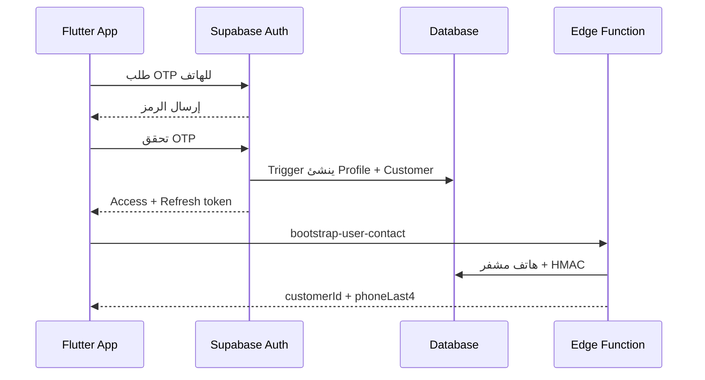

# مرجع API وتسلسل العمليات — دفتر الديون

**الحالة:** مطابق للـ Backend الحالي حتى الترحيل `011`.

## 1. العنوان والمصادقة

في الإنتاج استبدل `<SUPABASE_URL>` بعنوان مشروع Supabase. في البيئة المحلية:

```text
<SUPABASE_URL> = http://127.0.0.1:55321
REST RPC         = <SUPABASE_URL>/rest/v1/rpc/<function-name>
Edge Function    = <SUPABASE_URL>/functions/v1/<function-name>
```

كل API للتطبيق، ما لم يذكر غير ذلك، يحتاج الترويسات التالية:

```http
apikey: <SUPABASE_ANON_KEY>
Authorization: Bearer <USER_ACCESS_TOKEN>
Content-Type: application/json
```

لا يوضع `SUPABASE_SERVICE_ROLE_KEY` في Flutter أو أي عميل. هو مخصص فقط لـ Edge Functions والعمال الخلفيين.

## 2. API الهوية (Supabase Auth)

| العملية | الطريقة والمسار | المدخلات | النتيجة |
|---|---|---|---|
| طلب رمز الهاتف | `POST /auth/v1/otp` | `{ "phone": "+9677..." }` | إرسال رمز OTP. |
| تأكيد الرمز | `POST /auth/v1/verify` | `{ "type":"sms", "phone":"+9677...", "token":"123456" }` | `access_token` و`refresh_token` والمستخدم. |
| تجديد الجلسة | `POST /auth/v1/token?grant_type=refresh_token` | `{ "refresh_token":"..." }` | رموز محدثة. |
| قراءة المستخدم الحالي | `GET /auth/v1/user` | Bearer token | هوية المستخدم والجوال المتحقق منه. |
| تسجيل الخروج | `POST /auth/v1/logout` | Bearer token | إبطال الجلسة. |

بعد أول تأكيد OTP ينشئ trigger في قاعدة البيانات تلقائياً صفاً في `profiles` وصفاً في `customers`. لا ينشئ التطبيق هذين السجلين بنفسه.

## 3. Edge Functions

جميع الأخطاء الموحدة تأخذ الشكل:

```json
{ "error": { "code": "forbidden", "message": "..." } }
```

### 3.1 واجهات المستخدم

| Function | الطلب | الصلاحية | الاستجابة / الملاحظات |
|---|---|---|---|
| `bootstrap-user-contact` | `POST /functions/v1/bootstrap-user-contact`، بلا body | مستخدم مسجل بهاتف موثق | `{ "customerId", "phoneLast4" }`. يشفّر الهاتف ويخزن HMAC للبحث. يستدعى مرة بعد التسجيل أو عند تغيير الرقم. |
| `customer-directory` | `POST /functions/v1/customer-directory` | owner/admin/accountant/cashier في المحل | يبحث عن الهاتف أو ينشئ عميلاً غير مسجل، ثم يضيفه للمحل. |
| `signed-document-upload` | `POST /functions/v1/signed-document-upload` | مستخدم يملك حق الكيان | ينشئ جلسة رفع وتوقيع Storage مؤقت. |
| `finalize-document-upload` | `POST /functions/v1/finalize-document-upload` | مالك جلسة الرفع | يتحقق من الحجم والبصمة ويربط الملف بالقيد أو رسالة الاعتراض. |
| `verify-statement` | `GET /functions/v1/verify-statement?code=ST-...` | عام، بلا جلسة | يتحقق من كود كشف الحساب فقط، مع تحديد معدل الطلبات. |

#### `customer-directory` body

```json
{
  "businessId": "uuid",
  "phone": "+967700000000",
  "localDisplayName": "أحمد محمد",
  "creditLimit": 500000,
  "defaultDueDays": 30,
  "requestLink": true
}
```

الاستجابة `201`:

```json
{
  "businessCustomerId": "uuid",
  "linkRequestId": "uuid أو null",
  "isRegistered": true,
  "phoneLast4": "0000",
  "globalCode": "CUS-..."
}
```

إذا كان العميل غير مسجل في التطبيق، ينشأ كعميل محلي آمن ولا يوجد طلب ربط. عند تسجيله لاحقاً برقم الهاتف نفسه، يحتاج مسار ربط مناسب لربط هويته بسجله الحالي قبل عرض البيانات له.

#### `signed-document-upload` body

```json
{
  "entityType": "ledger_entry",
  "entityId": "uuid",
  "filename": "invoice-1025.pdf",
  "mimeType": "application/pdf",
  "sizeBytes": 430120,
  "sha256Hex": "اختياري-64-hex"
}
```

`entityType` إما `ledger_entry` أو `dispute_message`. الأنواع المقبولة: JPEG وPNG وWebP وPDF، والحجم الأقصى 10 MiB. الاستجابة تضم `uploadSessionId` و`bucketId` و`objectPath` و`signedUrl` و`token` وصلاحيته 900 ثانية. بعد رفع الملف إلى الرابط الموقّع يجب استدعاء:

```json
POST /functions/v1/finalize-document-upload
{ "uploadSessionId": "uuid" }
```

والاستجابة: `{ "fileId":"uuid", "sha256Hex":"..." }`.

#### `verify-statement`

لا يعيد بيانات العميل أو المحل. الاستجابة عند صحة الرمز:

```json
{
  "valid": true,
  "generatedAt": "...",
  "periodFrom": "...",
  "periodTo": "...",
  "currencyCode": "YER",
  "closingBalance": 60000,
  "documentHash": "... أو null",
  "hasDocument": false
}
```

### 3.2 وظائف العامل الخلفي

| Function | الحماية | الحالة |
|---|---|---|
| `process-notification-outbox` | `POST` مع `x-worker-secret`، body اختياري `{ "limit": 50 }` | جاهز؛ يطالب بدفعة إشعارات ويرسل Expo عند ضبط `PUSH_PROVIDER=expo`. |
| `process-automation-rules` | `POST` مع `x-worker-secret` | موجود لكنه يعيد `ready_not_activated`؛ لا يُشغل التذكيرات بعد. |
| `generate-statement` | Bearer token | ينشئ لقطة كشف ذرية عند الحاجة، ويولّد PDF، ويرفعه إلى bucket خاص، ويحفظ SHA-256 ثم يعيد رابط تنزيل موقّع قصير العمر. |

هذه الوظائف لا تستدعى من واجهة المستخدم مباشرة عدا `generate-statement` لاحقاً بعد إكماله. يستدعيها cron أو خادم موثوق.

## 4. واجهات أوامر الأعمال (RPC)

استدعاء RPC يكون بالطريقة:

```http
POST /rest/v1/rpc/create_business
```

واسم كل خاصية في JSON يطابق اسم المعامل في الجدول التالي.

### 4.1 الهوية والمحل والطاقم

| RPC | body | من يملك الصلاحية | النتيجة |
|---|---|---|---|
| `create_business` | `p_name`, `p_business_type`, `p_currency_code`, `p_country_code?="YE"`, `p_city?`, `p_address?` | أي مستخدم مسجل | `uuid` المحل؛ يصبح المستخدم owner ويتولد دليل الحسابات. |
| `invite_business_member` | `p_business_id`, `p_target_user_id`, `p_role`, `p_expires_at?` | owner أو admin | `uuid` الدعوة. لا يمكن دعوة owner أو دعوة الذات. |
| `respond_business_member_invite` | `p_invite_id`, `p_accept` | المدعو فقط | لا body؛ عند القبول تنشأ عضوية نشطة. |

قيم `p_role`: `admin`, `accountant`, `cashier`, `collector`, `viewer`. دور `owner` لا يُدعى إليه.

### 4.2 العملاء والربط

| RPC | body | الصلاحية | النتيجة |
|---|---|---|---|
| `add_business_customer` | `p_business_id`, `p_customer_id`, `p_local_display_name`, `p_credit_limit?`, `p_default_due_days?` | owner/admin/accountant/cashier | `uuid` سجل العميل داخل المحل. غالباً يستعمل التطبيق `customer-directory` بدلاً منه. |
| `request_customer_link` | `p_business_customer_id` | طاقم مخول | `uuid` طلب الربط. يشترط أن يكون للعميل حساب. |
| `respond_link_request` | `p_request_id`, `p_accept` | العميل المستهدف | لا body؛ القبول يجعل الرابط `linked`. |

`p_default_due_days` و`p_due_date` اختياريان؛ لا يجبر النظام المستخدم على تحديد استحقاق.

### 4.3 الذمم والعمليات المالية

| RPC | body | الصلاحية | النتيجة |
|---|---|---|---|
| `create_ledger_entry` | `p_business_customer_id`, `p_entry_type`, `p_amount`, `p_description`, `p_occurred_at?`, `p_due_date?`, `p_external_reference?`, `p_client_request_id`, `p_source_device_id?` | owner/admin/accountant/cashier | `uuid` القيد. |
| `apply_customer_discount` | `p_business_customer_id`, `p_amount`, `p_description`, `p_occurred_at?`, `p_client_request_id` | owner/admin/accountant | `uuid` خصم يخفض ما على العميل. |
| `reverse_ledger_entry` | `p_entry_id`, `p_reason`, `p_client_request_id` | owner/admin/accountant | `uuid` قيد عكس بنفس القيمة. |
| `confirm_ledger_entry` | `p_entry_id`, `p_device_id?` | العميل المرتبط | `uuid` تأكيد العملية مرة واحدة. |

قيم `p_entry_type` في `create_ledger_entry`: `opening_balance`, `debt`, `payment` فقط. الخصم له RPC منفصل كي لا يستطيع الكاشير منحه بلا صلاحية مرتفعة. كل أمر مالي يتطلب `p_client_request_id` UUID ثابتاً يولده الجهاز قبل الإرسال؛ عند إعادة الإرسال يعاد نفس `uuid` ولا يتكرر الأثر المالي.

مثال دين:

```json
{
  "p_business_customer_id": "uuid",
  "p_entry_type": "debt",
  "p_amount": 25000,
  "p_description": "مشتريات فاتورة 1025",
  "p_occurred_at": "2026-08-14T10:30:00Z",
  "p_due_date": null,
  "p_external_reference": "INV-1025",
  "p_client_request_id": "UUID-ثابت-من-الجهاز",
  "p_source_device_id": "uuid أو null"
}
```

مثال دفعة مقدمة: أرسل `p_entry_type: "payment"`، حتى لو تجاوز المبلغ المستحق. إذا كان إعداد المحل `allow_customer_credit_balance=true` (الافتراضي)، يظهر الفرق في `amount_business_owes_customer` بوصفه «له مبلغ».

### 4.4 الاعتراض وكشوف الحساب

| RPC | body | الصلاحية | النتيجة |
|---|---|---|---|
| `open_dispute` | `p_entry_id`, `p_reason`, `p_description` | العميل المرتبط | `uuid` اعتراض جديد. |
| `add_dispute_message` | `p_dispute_id`, `p_message` | العميل أو طاقم مخول | `uuid` رسالة. |
| `resolve_dispute` | `p_dispute_id`, `p_resolution`, `p_resolution_note`, `p_corrected_amount?` | owner/admin/accountant | `uuid` للقيد الناتج عند القبول. |
| `create_statement` | `p_scope`, `p_business_customer_id?`, `p_period_from?`, `p_period_to?` | طاقم مخول أو العميل لنطاقه | `uuid` كشف حساب مثبت. |

أسباب الاعتراض: `wrong_amount`, `unknown_transaction`, `duplicate`, `already_paid`, `wrong_date`, `wrong_description`, `other`.

نتائج الحل: `accepted`, `partially_accepted`, `rejected`. عند القبول الجزئي يطلب `p_corrected_amount` أقل من الأصل وأكبر من الصفر، وينشئ النظام عكساً وقيداً مصححاً.

قيم `p_scope`:

- `business_customer`: يحتاج `p_business_customer_id`.
- `customer_consolidated`: يخص العميل المسجل؛ لا تقبل قيمة `p_business_customer_id` ولا تعدد عملات.

### 4.5 المحاسبة

| RPC | body | الصلاحية | النتيجة |
|---|---|---|---|
| `post_manual_journal` | `p_business_id`, `p_entry_date`, `p_description`, `p_lines`, `p_source_reference?` | owner/admin/accountant | `uuid` لقيد يومية متزن. |
| `close_accounting_period` | `p_business_id`, `p_period_start`, `p_period_end` | owner/admin/accountant | `uuid` للفترة المقفلة. |

`p_lines` مصفوفة من سطرين على الأقل. كل سطر يحتوي `account_id`, `debit_amount`, `credit_amount`, `description?`. يجب أن يملك السطر مديناً أو دائناً فقط، وأن يتساوى إجمالي الطرفين. لا يسمح بالقيد اليدوي إلى حساب العملاء الضابط.

## 5. واجهات القراءة المباشرة (REST)

تستدعى عبر `GET /rest/v1/<resource>?...` أو من عميل Supabase. RLS يرشح النتائج دائماً حسب المستخدم؛ لا تبنِ شرط صلاحية في Flutter بدلاً منه.

| المورد | الاستخدام |
|---|---|
| `profiles` | الملف الشخصي للمستخدم الحالي. |
| `businesses`, `business_members`, `business_member_invites` | محلاتي وطاقمي ودعواتي. |
| `business_customers`, `customer_link_requests` | عملاء المحل وروابطهم، أو روابط العميل نفسه. |
| `ledger_entries`, `ledger_entry_state`, `ledger_entry_events`, `ledger_timeline` | الذمم وحالاتها وخطها الزمني. |
| `business_customer_balances`, `business_customer_account_positions`, `customer_business_summary` | الرصيد، ما على العميل وما له، وملخص محلات العميل. |
| `disputes`, `dispute_state`, `dispute_events`, `dispute_messages` | الاعتراضات. |
| `files`, `ledger_entry_files`, `dispute_message_files` | بيانات وصف المرفقات المصرح بها. |
| `notifications`, `device_push_tokens`, `reminders` | الإشعارات وأجهزة المستخدم والتذكيرات. |
| `statements`, `statement_items` | لقطة كشف الحساب. |
| `chart_of_accounts`, `business_accounting_settings`, `accounting_periods`, `journal_entries`, `journal_entry_lines`, `account_trial_balance` | المحاسبة؛ للطاقم فقط. |
| `user_consents` | موافقات المستخدم نفسه. |

الكتابة المباشرة المسموح بها ومحدودة هي: تحديث الملف الشخصي، بيانات المحل للأدوار الإدارية، ملاحظات/حدود العميل للطاقم، رموز push، حالة قراءة الإشعار، التذكيرات، والموافقات. كل كتابة مالية يجب أن تتم عبر RPC.

## 6. التسلسل الكامل للعمليات

### أ. التسجيل وتهيئة المستخدم



بعدها يحدث التطبيق `profiles` ويضيف موافقات الشروط عبر `user_consents`. ثم يختار المستخدم إنشاء محل أو العمل كعميل أو قبول دعوة موظف.

### ب. عميل جديد ثم شراء آجل

1. الموظف يستدعي `customer-directory` برقم العميل واسم العرض.
2. الخدمة تبحث بالـ HMAC؛ فإن لم تجد عميلاً تنشئ هوية عميل غير مسجل وهاتفاً مشفراً.
3. تنشئ `business_customers` محلياً للمحل؛ يمكن تحديد حد ائتماني وأيام استحقاق أو تركهما فارغين.
4. إن كان العميل مسجلاً واختار الموظف ذلك، تنشئ الخدمة طلب ربط.
5. يسجل الموظف الدين عبر `create_ledger_entry` بنوع `debt` ومعرّف طلب ثابت.
6. في المعاملة نفسها ينشأ قيد الذمة والحالة والأحداث والإشعار والقيد اليومي: مدين العملاء / دائن المبيعات.

### ج. السداد والخصم وحالة «عليه/له»

1. يسجل الموظف `payment` مع المبلغ والوصف والمرجع والملاحظات ومعرّف الطلب الثابت.
2. ينشأ القيد المحاسبي: مدين الصندوق / دائن العملاء.
3. إذا تجاوزت الدفعة الرصيد وسمح إعداد المحل بذلك، لا ترفض؛ تظهر القيمة الزائدة في `amount_business_owes_customer` كرصيد لصالح العميل.
4. الخصم يستدعى بـ `apply_customer_discount`؛ النظام يتحقق أنه لا يتجاوز الرصيد المدين وينشئ: مدين خصومات المبيعات / دائن العملاء.
5. تعرض الواجهة دائماً `amount_customer_owes` و`amount_business_owes_customer` بدلاً من كتابة «عليه/له» يدوياً.

**العملة الحالية:** كل محل يعمل بعملة أساس واحدة من `businesses.currency_code`. لا يرسل التطبيق عملة مختلفة للدفعة حالياً. الدفع متعدد العملات يحتاج مرحلة مستقلة تضيف سعر الصرف ومبلغ العملة الأصلية وفروق العملة.

### د. العميل المرتبط والاعتراض

1. العميل يرى القيود فقط بعد قبول الربط.
2. يؤكد القيد بـ `confirm_ledger_entry` أو يفتح اعتراضاً بـ `open_dispute`.
3. يمكن للطرفين تبادل الرسائل وإرفاق المستندات.
4. الموظف المحاسبي يحل الاعتراض. القبول أو التصحيح لا يعدل السجل الأصلي، بل ينشئ قيد عكس وقيداً مصححاً عند الحاجة.

### هـ. المزامنة دون إنترنت

1. ينشئ Flutter UUID لكل أمر مالي ويحفظه محلياً مع `pending`.
2. عند الاتصال يرسل RPC نفسه وبـ `p_client_request_id` نفسه.
3. إن انقطع الرد أو أعيدت المحاولة، يعيد الخادم UUID القيد الأول بدلاً من تكراره.
4. يقرأ التطبيق الأحداث والأرصدة من REST، ويحفظ مؤشره في `sync_checkpoints` عند اكتمال طبقة المزامنة في العميل.

## 7. أكواد الاستجابة المتوقعة

| الرمز | المعنى |
|---:|---|
| 200 | قراءة أو عملية ناجحة. |
| 201 | إنشاء مورد Edge Function (عميل/جلسة رفع/ملف). |
| 400 | صيغة غير صحيحة أو قاعدة أعمال مرفوضة. |
| 401 | لا توجد جلسة أو رمز غير صالح. |
| 403 | الدور أو الربط لا يسمح بالعملية. |
| 404 | كيان أو جلسة رفع غير موجودة/منتهية. |
| 422 | بيانات ناقصة أو غير صالحة. |
| 429 | تجاوز معدل الطلبات. |
| 501 | وظيفة اختيارية معرّفة في العقد لكنها غير مفعلة في البيئة الحالية. لا تعيد خدمات النسخة الأولى المكتملة هذا الرمز في المسار الطبيعي. |

## 8. ما لا يجب أن يستدعيه التطبيق

- أي دالة تبدأ بـ `service_` أو أي شيء داخل schema `private`.
- `process-notification-outbox` و`process-automation-rules` دون سر العامل.
- تعديل `ledger_entries` أو `journal_entries` أو `journal_entry_lines` مباشرة.
- مفاتيح service role أو مفاتيح تشفير الهاتف.

## 9. حالة الإطلاق

مكتمل للاستخدام البرمجي: Auth المحلي، أوامر الأعمال، العزل RLS، الذمم، المحاسبة المزدوجة، المرفقات، كشف الحساب المثبت، ودورة الإشعارات الداخلية.

قبل الإطلاق للمستخدمين: ربط مزود SMS حقيقي، بناء واجهة Flutter، نشر Edge Functions وضبط متغيراتها السرية، تفعيل Push عند اختيار المزوّد، وإنهاء توليد PDF والتذكيرات المجدولة.
