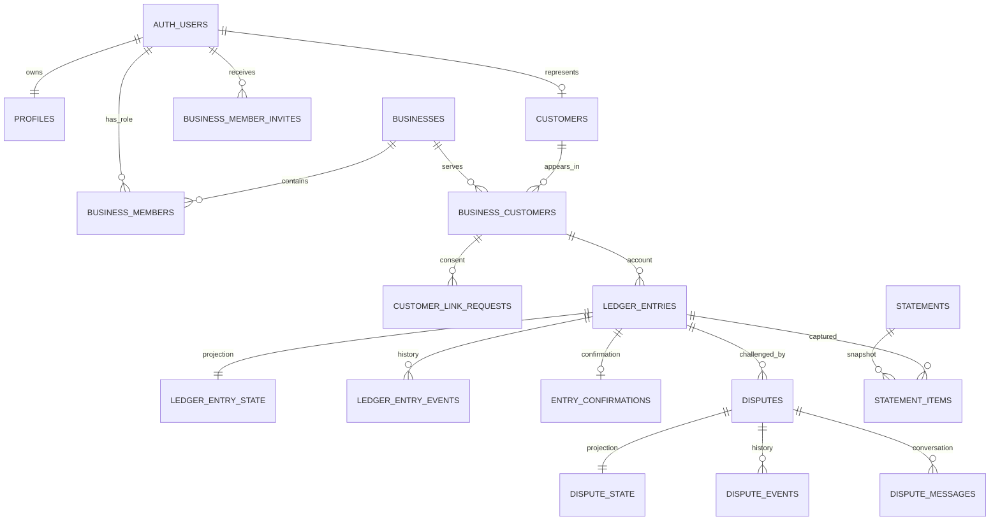

# مواصفة قاعدة البيانات والعمليات — دفتر الديون (الإصدار الأول)

**حالة الوثيقة:** مرجع تنفيذي مطابق للترحيلات `001` إلى `008` في `supabase/migrations`.

**حالة الأساس:** مكتمل ومختبر محلياً في Supabase/PostgreSQL. مصدر الحقيقة المالي هو دفتر الأستاذ الملحق فقط؛ لا يُعدّل السجل المالي ولا يُحذف، بل يُصحّح بسجل عكس وسجل بديل عند الحاجة.

## 1. الهدف وحدود الإصدار الأول

التطبيق يدير ديون العملاء ومدفوعاتهم لكل محل بصورة مستقلة وآمنة. يدعم المستخدم أن يكون مالك محل وموظفاً فيه وعميلاً في الوقت نفسه. لا يرى العميل بيانات أي محل قبل موافقته الصريحة على ربط الحساب.

النطاق الموجود في قاعدة البيانات:

- حسابات المستخدمين، الملف الشخصي، وهوية العميل العامة.
- المحلات والأدوار والدعوات والعميل المحلي لكل محل.
- الربط القائم على موافقة العميل.
- دفتر دين/دفعة غير قابل للتعديل، تأكيد العميل، الاعتراض، العكس والتصحيح.
- المرفقات، الإشعارات، تذكيرات الدفع، كشوف الحساب القابلة للتحقق.
- العمل دون اتصال عبر معرّفات طلبات ثابتة وإيصالات أوامر ونقاط مزامنة.
- إعدادات الأتمتة وطابور الإشعارات والسجل التشغيلي الخاص.

النطاق المؤجل عمداً: إرسال SMS/Push حقيقي، مولّد PDF النهائي لكشف الحساب، واجهة Flutter، وتفعيل قواعد التذكير المجدولة في الإنتاج. الجداول والعقود اللازمة لها موجودة، لكن لا ينبغي اعتبارها مفعّلة للمستخدم حتى تُنجز دوال التنفيذ ومفاتيح المزوّدات.

## 2. مبادئ التصميم

1. **عزل المحلات:** كل معلومة مالية تحمل `business_id` أو ترتبط بسجل عميل محل يحمل هذا المعرّف.
2. **دفتر ملحق فقط:** `ledger_entries` لا يقبل تحديثاً أو حذفاً. التصحيح = `reversal` بعكس الاتجاه + إدخال صحيح جديد عند التصحيح الجزئي.
3. **العميل العالمي مقابل العميل المحلي:** `customers` يمثل الإنسان، و`business_customers` يمثل علاقته واسم عرضه وحده الائتماني داخل محل محدد.
4. **الموافقة قبل الإظهار:** لا يصبح `link_status = linked` إلا عبر قبول صاحب حساب العميل. سياسات RLS ودوال الأوامر تمنع القراءة والتأكيد والاعتراض قبل ذلك.
5. **الأوامر هي بوابة الكتابة:** التطبيق يستدعي RPC عامة محددة؛ لا يكتب مباشرة في جداول المال أو الحالات المشتقة.
6. **دعم عدم الاتصال:** يحتفظ التطبيق المحلي بـ `client_request_id` نفسه عند الإعادة؛ الدالة تعيد نتيجة العملية الأولى بدلاً من إنشاء قيد مكرر.
7. **أقل صلاحية:** البيانات الشخصية الحساسة وطوابير النظام داخل مخطط `private`، وتُستدعى من Edge Functions ذات `service_role` فقط.
8. **محاسبة مزدوجة:** كل حركة عميل تنشئ قيداً يومياً متزناً؛ مدين العملاء/دائن الإيراد للدين، ومدين الصندوق/دائن العملاء للدفعة، ومدين الخصم/دائن العملاء للخصم.

تفاصيل دليل الحسابات والقيود والرصيد «عليه/له» موثقة في [مواصفة المحاسبة المزدوجة](double-entry-accounting-spec.md).

## 3. خريطة العلاقات

علاقات مرجعية إضافية: `files` ترتبط بالمحل أو العميل ثم تُربط بـ `ledger_entry_files` أو `dispute_message_files`؛ و`notifications` تخص مستخدماً، ولها سجل داخلي واحد في `private.notification_outbox`.

## 4. الأنواع والحالات المعتمدة

| المجال | القيم |
|---|---|
| دور الموظف `business_role` | `owner`, `admin`, `accountant`, `cashier`, `collector`, `viewer` |
| حالة رابط العميل | `unlinked`, `pending`, `linked`, `rejected`, `blocked` |
| نوع السجل المالي | `opening_balance`, `debt`, `payment`, `reversal` |
| اتجاهه | `debit`, `credit` |
| تأكيد العميل | `not_available`, `pending`, `confirmed` |
| الاعتراض الحالي | `open`, `awaiting_merchant`, `awaiting_customer`, `accepted`, `partially_accepted`, `rejected`, `escalated`, `closed` |
| حالة دعوة العضو | `pending`, `accepted`, `rejected`, `expired`, `cancelled` |
| نطاق كشف الحساب | `business_customer`, `customer_consolidated` |
| الإشعار | `link_request`, `ledger_created`, `ledger_confirmed`, `ledger_disputed`, `dispute_reply`, `dispute_resolved`, `payment_due`, `reminder`, `security`, `system` |

العملة في الإصدار الأول تخص المحل (`businesses.currency_code`) وتُخزّن مع كل إدخال. كشف العميل المجمّع يرفض إنشاءه عند وجود أكثر من عملة.

## 5. قاموس البيانات — الجداول العامة

الرموز: `PK` مفتاح رئيسي، `FK` مرجع، `NN` إلزامي. الحقل الأول `id` في أغلب الجداول UUID يولّد تلقائياً.

### الهوية والعملاء

| الجدول | الأعمدة |
|---|---|
| `profiles` | `id uuid PK/FK auth.users NN`, `display_name text NN`, `avatar_path text`, `city text`, `preferred_language text NN`, `status account_status NN`, `created_at timestamptz NN`, `updated_at timestamptz NN` |
| `customers` | `id uuid PK NN`, `user_id uuid FK auth.users UNIQUE`, `global_code text NN UNIQUE`, `status customer_status NN`, `merged_into_customer_id uuid FK customers`, `created_at timestamptz NN` |
| `user_consents` | `id uuid PK NN`, `user_id uuid FK auth.users NN`, `type consent_type NN`, `document_version text NN`, `granted boolean NN`, `metadata jsonb NN`, `created_at timestamptz NN` |
| `device_installations` | `id uuid PK NN`, `user_id uuid FK auth.users NN`, `device_id uuid NN`, `platform text NN`, `device_name text`, `app_version text`, `last_seen_at timestamptz NN`, `revoked_at timestamptz`, `created_at timestamptz NN`, `updated_at timestamptz NN` |
| `device_push_tokens` | `id uuid PK NN`, `user_id uuid FK auth.users NN`, `device_id uuid NN`, `platform text NN`, `push_token text NN UNIQUE`, `is_active boolean NN`, `last_seen_at timestamptz NN`, `created_at timestamptz NN`, `updated_at timestamptz NN`; فريد أيضاً حسب `(user_id, device_id)` |

ينشئ trigger على `auth.users` صف `profiles` وصف `customers` تلقائياً. هاتف العميل لا يُخزن في هذه الجداول.

### المحلات، الطاقم وربط العملاء

| الجدول | الأعمدة |
|---|---|
| `businesses` | `id uuid PK NN`, `owner_user_id uuid FK auth.users NN`, `name text NN`, `business_type text NN`, `currency_code varchar(3) NN`, `country_code varchar(2) NN`, `city text`, `address text`, `contact_phone_display text`, `logo_path text`, `timezone text NN`, `status business_status NN`, `created_at timestamptz NN`, `updated_at timestamptz NN` |
| `business_members` | `id uuid PK NN`, `business_id uuid FK businesses NN`, `user_id uuid FK auth.users NN`, `role business_role NN`, `status member_status NN`, `invited_by_user_id uuid FK auth.users`, `created_at timestamptz NN`, `updated_at timestamptz NN`; فريد `(business_id, user_id)` |
| `business_member_invites` | `id uuid PK NN`, `business_id uuid FK businesses NN`, `target_user_id uuid FK auth.users NN`, `role business_role NN` (ليس `owner`), `status member_invite_status NN`, `invited_by_user_id uuid FK auth.users NN`, `responded_at timestamptz`, `expires_at timestamptz NN`, `created_at timestamptz NN`, `updated_at timestamptz NN`; دعوة معلقة واحدة لكل عضو ومحل |
| `business_customers` | `id uuid PK NN`, `business_id uuid FK businesses NN`, `customer_id uuid FK customers NN`, `local_display_name text NN`, `local_note text`, `credit_limit numeric(20,4)`, `default_due_days smallint`, `link_status customer_link_status NN`, `is_archived boolean NN`, `created_by_user_id uuid FK auth.users NN`, `created_at timestamptz NN`, `updated_at timestamptz NN`; فريد `(business_id, customer_id)` |
| `customer_link_requests` | `id uuid PK NN`, `business_customer_id uuid FK business_customers NN`, `requested_by_user_id uuid FK auth.users NN`, `target_customer_id uuid FK customers NN`, `status link_request_status NN`, `token_hash text UNIQUE`, `expires_at timestamptz NN`, `responded_by_user_id uuid FK auth.users`, `responded_at timestamptz`, `created_at timestamptz NN`, `updated_at timestamptz NN`; طلب معلق واحد لكل سجل عميل محل |
| `business_automation_settings` | `business_id uuid PK/FK businesses NN`, `timezone text NN`, `send_from_local_time time NN`, `send_until_local_time time NN`, `allow_push boolean NN`, `updated_at timestamptz NN` |
| `automation_rules` | `id uuid PK NN`, `business_id uuid FK businesses NN`, `rule_key text NN`, `trigger_type text NN`, `offset_days smallint NN`, `channel reminder_channel NN`, `message_template text NN`, `is_active boolean NN`, `created_by_user_id uuid FK auth.users NN`, `created_at timestamptz NN`, `updated_at timestamptz NN` |
| `automation_runs` | `id uuid PK NN`, `rule_id uuid FK automation_rules NN`, `business_customer_id uuid FK business_customers`, `ledger_entry_id uuid FK ledger_entries`, `run_key text NN UNIQUE`, `status text NN`, `result jsonb NN`, `attempted_at timestamptz`, `completed_at timestamptz`, `created_at timestamptz NN` |

### دفتر المال والتأكيد والاعتراض

| الجدول | الأعمدة |
|---|---|
| `ledger_entries` | `id uuid PK NN`, `business_id uuid FK businesses NN`, `business_customer_id uuid FK business_customers NN`, `customer_id uuid FK customers NN`, `entry_type ledger_entry_type NN`, `direction ledger_direction NN`, `amount numeric(20,4) NN`, `currency_code varchar(3) NN`, `description text NN`, `occurred_at timestamptz NN`, `due_date date`, `external_reference text`, `reversal_of_entry_id uuid FK ledger_entries UNIQUE`, `client_request_id uuid NN`, `source_device_id uuid`, `created_by_user_id uuid FK auth.users NN`, `created_at timestamptz NN`; فريد `(business_id, client_request_id)` |
| `ledger_entry_state` | `entry_id uuid PK/FK ledger_entries NN`, `confirmation_status entry_confirmation_status NN`, `dispute_status entry_dispute_status NN`, `is_reversed boolean NN`, `reversal_entry_id uuid FK ledger_entries`, `last_event_at timestamptz NN`, `updated_at timestamptz NN` |
| `ledger_entry_events` | `id bigint PK NN`, `entry_id uuid FK ledger_entries NN`, `business_id uuid FK businesses NN`, `customer_id uuid FK customers NN`, `event_type entry_event_type NN`, `actor_user_id uuid FK auth.users`, `metadata jsonb NN`, `created_at timestamptz NN` |
| `entry_confirmations` | `id uuid PK NN`, `entry_id uuid FK ledger_entries NN UNIQUE`, `customer_id uuid FK customers NN`, `confirmed_by_user_id uuid FK auth.users NN`, `device_id uuid`, `confirmed_at timestamptz NN` |
| `disputes` | `id uuid PK NN`, `entry_id uuid FK ledger_entries NN`, `business_id uuid FK businesses NN`, `customer_id uuid FK customers NN`, `opened_by_user_id uuid FK auth.users NN`, `reason dispute_reason NN`, `description text NN`, `created_at timestamptz NN` |
| `dispute_state` | `dispute_id uuid PK/FK disputes NN`, `status dispute_current_status NN`, `resolution_note text`, `resolved_by_user_id uuid FK auth.users`, `resolved_at timestamptz`, `updated_at timestamptz NN` |
| `dispute_events` | `id bigint PK NN`, `dispute_id uuid FK disputes NN`, `event_type dispute_event_type NN`, `actor_user_id uuid FK auth.users NN`, `note text`, `metadata jsonb NN`, `created_at timestamptz NN` |
| `dispute_messages` | `id uuid PK NN`, `dispute_id uuid FK disputes NN`, `sender_user_id uuid FK auth.users NN`, `message text NN`, `created_at timestamptz NN` |

التحققات الجوهرية في `ledger_entries`: القيمة موجبة، الدين والرصيد الافتتاحي مدينان، الدفعة دائنة، والعكس يحمل مرجعاً أصلياً واتجاهاً معاكساً. لا يسمح العكس بعكس عكس آخر، ولا بأكثر من عكس للسجل الأصلي.

### الملفات، الإشعارات والتذكيرات

| الجدول | الأعمدة |
|---|---|
| `files` | `id uuid PK NN`, `business_id uuid FK businesses`, `customer_id uuid FK customers`, `bucket_id text NN`, `object_path text NN UNIQUE`, `original_filename text NN`, `mime_type text NN`, `size_bytes bigint NN`, `sha256_hex text`, `uploaded_by_user_id uuid FK auth.users NN`, `created_at timestamptz NN`; يجب أن ينتمي للمحل أو العميل، وحجمه حتى 10 MiB |
| `ledger_entry_files` | `entry_id uuid PK/FK ledger_entries NN`, `file_id uuid PK/FK files NN` |
| `dispute_message_files` | `message_id uuid PK/FK dispute_messages NN`, `file_id uuid PK/FK files NN` |
| `notifications` | `id uuid PK NN`, `user_id uuid FK auth.users NN`, `type notification_type NN`, `title text NN`, `body text NN`, `entity_type text`, `entity_id uuid`, `data jsonb NN`, `delivery_status notification_delivery_status NN`, `read_at timestamptz`, `created_at timestamptz NN`, `updated_at timestamptz NN` |
| `reminders` | `id uuid PK NN`, `business_id uuid FK businesses NN`, `business_customer_id uuid FK business_customers NN`, `sent_by_user_id uuid FK auth.users NN`, `channel reminder_channel NN`, `message_snapshot text NN`, `status reminder_status NN`, `scheduled_at timestamptz`, `sent_at timestamptz`, `created_at timestamptz NN`, `updated_at timestamptz NN` |
| `upload_sessions` | `id uuid PK NN`, `user_id uuid FK auth.users NN`, `entity_type text NN`, `entity_id uuid NN`, `bucket_id text NN`, `object_path text NN`, `original_filename text NN`, `mime_type text NN`, `expected_size_bytes bigint NN`, `expected_sha256_hex text`, `expires_at timestamptz NN`, `consumed_at timestamptz`, `created_at timestamptz NN` |

`upload_sessions` لا تملك سياسة وصول مباشرة للمستخدم: الـ Edge Function فقط تنشئ الجلسة وتتحقق منها ثم تنقل الوصف إلى `files`.

### كشوف الحساب والمزامنة

| الجدول | الأعمدة |
|---|---|
| `statements` | `id uuid PK NN`, `scope statement_scope NN`, `business_id uuid FK businesses`, `business_customer_id uuid FK business_customers`, `customer_id uuid FK customers NN`, `period_from timestamptz NN`, `period_to timestamptz NN`, `currency_code varchar(3)`, `opening_balance numeric(20,4) NN`, `total_debits numeric(20,4) NN`, `total_credits numeric(20,4) NN`, `closing_balance numeric(20,4) NN`, `verification_code text NN UNIQUE`, `pdf_object_path text`, `snapshot_sha256_hex text`, `generated_by_user_id uuid FK auth.users NN`, `created_at timestamptz NN` |
| `statement_items` | `id bigint PK NN`, `statement_id uuid FK statements NN`, `entry_id uuid FK ledger_entries NN`, `item_order integer NN`, `occurred_at timestamptz NN`, `description_snapshot text NN`, `debit_amount numeric(20,4) NN`, `credit_amount numeric(20,4) NN`, `running_balance numeric(20,4) NN`, `confirmation_status entry_confirmation_status NN`; فريد `(statement_id, item_order)` و`(statement_id, entry_id)` |
| `command_receipts` | `idempotency_key uuid PK NN`, `user_id uuid FK auth.users NN`, `device_id uuid`, `command_type text NN`, `status text NN`, `result_entity_id uuid`, `result jsonb NN`, `created_at timestamptz NN` |
| `sync_checkpoints` | `id uuid PK NN`, `user_id uuid FK auth.users NN`, `device_id uuid NN`, `business_id uuid FK businesses`, `cursor_value timestamptz NN`, `updated_at timestamptz NN` |

الفترة في كشف الحساب `[period_from, period_to)`؛ لذلك تشمل البداية وتستثني النهاية. لا يسمح بإنشاء كشف حين تكون النهاية قبل/مساوية البداية.

### المحاسبة المزدوجة

| الجدول أو العرض | الأعمدة أو المخرجات الأساسية |
|---|---|
| `chart_of_accounts` | `id`, `business_id`, `parent_account_id`, `account_code`, `account_name`, `account_class`, `normal_balance`, `is_control_account`, `allows_manual_posting`, `status`, وتواريخ الإنشاء/التعديل. |
| `business_accounting_settings` | `business_id` ومراجع حسابات العملاء والصندوق والإيراد والخصم والرصيد الافتتاحي، مع `allow_customer_credit_balance`. |
| `accounting_periods` | `id`, `business_id`, `period_start`, `period_end`, `status`, `closed_by_user_id`, `closed_at`، وتواريخ التدقيق. |
| `journal_entries` | `id`, `entry_number`, `business_id`, `source_ledger_entry_id`, `source_type`, `source_reference`, `entry_date`, `description`, `status`, `posted_by_user_id`, `posted_at`, `created_at`. |
| `journal_entry_lines` | `id`, `journal_entry_id`, `line_number`, `account_id`, `business_customer_id`, `description`, `debit_amount`, `credit_amount`, `created_at`. |
| `account_trial_balance` | إجمالي المدين والدائن والرصيد الموقّع والرصيد بطبيعته لكل حساب. |
| `business_customer_account_positions` | الرصيد الموقّع للعميل، `amount_customer_owes` و`amount_business_owes_customer`. |

لا يمكن حذف أو تعديل القيود اليومية أو أسطرها. يتحقق trigger مؤجل من أن كل قيد يحوي سطرين على الأقل وأن مجموع مدينه يساوي مجموع دائنه.

## 6. المخطط الخاص `private`

لا يُعرض هذا المخطط عبر Data API. وصوله مقصور على دوال `security definer` أو `service_role`.

| الجدول | الأعمدة والغرض |
|---|---|
| `customer_contacts` | `customer_id uuid PK/FK customers`, `phone_hash text UNIQUE`, `phone_ciphertext bytea`, `phone_last4 text`, `encryption_key_version smallint NN`, `verified_at`, `created_at NN`, `updated_at NN`. رقم الهاتف مشفر؛ البحث بواسطة HMAC لا رقم صريح. |
| `notification_outbox` | `id bigint PK`, `notification_id uuid FK notifications UNIQUE`, `attempt_count smallint NN`, `available_at NN`, `locked_at`, `processed_at`, `last_error`, `created_at NN`. طابور تسليم ذري مع الإشعار. |
| `notification_delivery_attempts` | `id bigint PK`, `outbox_id bigint FK notification_outbox`, `provider text NN`, `device_token_id uuid`, `status text NN`, `provider_response jsonb`, `error text`, `created_at NN`. |
| `dead_letter_jobs` | `id bigint PK`, `job_type text NN`, `source_id text NN`, `error text NN`, `payload jsonb NN`, `created_at NN`, `resolved_at`. للمهام الفاشلة نهائياً. |
| `rate_limit_windows` | `scope text PK`, `subject_key text PK`, `window_started_at timestamptz PK`, `hit_count integer NN`. يحد RPC الحساسة وEdge Functions. |
| `audit_logs` | `id bigint PK`, `actor_user_id uuid`, `action text NN`, `entity_schema text NN`, `entity_table text NN`, `entity_id text`, `business_id uuid`, `old_data jsonb`, `new_data jsonb`, `request_id text`, `created_at NN`. |

## 7. العروض العامة للقراءة

| العرض | الاستخدام |
|---|---|
| `business_customer_balances` | الرصيد الحي لكل عميل محل: الرصيد، المدين المتأخر، عدد القيود وآخر قيد. يحسب من دفتر الأستاذ لا من قيمة مخزنة. |
| `customer_business_summary` | بطاقات المحلات المرتبطة بالعميل ورصيد كل واحدة. |
| `ledger_timeline` | خط زمني يضم القيد المالي وحالة التأكيد والاعتراض والعكس. |

كل هذه العروض تستعمل `security_invoker=true`؛ أي أن سياسات RLS للمتصل هي التي تحكم النتيجة.

## 8. واجهات الأوامر (RPC) المعتمدة

| الدالة العامة | صاحب الصلاحية | الأثر |
|---|---|---|
| `create_business` | مستخدم مسجل | ينشئ المحل ويضيف المالك كعضو `owner`. |
| `add_business_customer` | owner/admin/accountant/cashier | يربط العميل العالمي بالمحل ويحدد الاسم المحلي والحد الائتماني. |
| `request_customer_link` / `respond_link_request` | طاقم المحل ثم العميل | دورة موافقة الربط. |
| `create_ledger_entry` | owner/admin/accountant/cashier | ينشئ ديناً أو دفعةً بعد التحقق من الرصيد والحد الائتماني ومعرّف التكرار. |
| `reverse_ledger_entry` | owner/admin/accountant | ينشئ عكساً فقط، ولا يعدّل الأصل. |
| `confirm_ledger_entry` | العميل المرتبط | تأكيد واحد لكل قيد. |
| `open_dispute`, `add_dispute_message` | العميل المرتبط/الأطراف المخوّلة | فتح اعتراض ومحادثته. |
| `resolve_dispute` | owner/admin/accountant | قبول/رفض/قبول جزئي؛ القبول ينشئ العكس والتصحيح عند الحاجة. |
| `invite_business_member`, `respond_business_member_invite` | owner/admin ثم المدعو | دعوة قابلة للتدقيق، ثم عضوية نشطة عند القبول. |
| `create_statement` | طاقم مخوّل أو العميل لنطاقه | يحسب ويثبت لقطة كشف حساب وعناصره. |
| `service_*` | `service_role` فقط | الهاتف، الجلسات، تسليم الإشعارات، تحديد المعدل، وربط PDF بالكشف. |

## 9. تسلسل العمليات الأساسية

### إنشاء دين ثم دفعة

1. الموظف ينشئ/يختار `business_customer`.
2. عند وجود حساب للعميل، يرسل طلب ربط؛ يقبله العميل، فتغدو الحالة `linked`.
3. يستدعي الموظف `create_ledger_entry(..., 'debt', ...)` مع `client_request_id` ثابت من التطبيق المحلي.
4. ينشأ القيد وحالة القيد والحدث والإشعار داخل معاملة واحدة.
5. الدفعة تستدعي الدالة نفسها بنوع `payment`؛ يمنع النظام دفع قيمة تفوق الرصيد.
6. إذا أعاد التطبيق الإرسال بعد انقطاع الشبكة، تعاد UUID السابقة ولا ينشأ قيد جديد.

### تأكيد واعتراض وتصحيح

1. العميل المرتبط يؤكد القيد أو يفتح اعتراضاً.
2. الاعتراض النشط يمنع التأكيد، ويسجّل الحدث والحالة.
3. الموظف المخول يرد أو يحل الاعتراض.
4. القبول الكامل ينشئ عكساً، والقبول الجزئي ينشئ عكساً ثم قيداً مصححاً؛ يبقى التاريخ قابلاً للمراجعة.
5. الحالة النهائية لا تقبل رسائل لاحقة ولا حلاً ثانياً.

### كشف الحساب

1. يطلب العميل كشفه المربوط أو يطلب طاقم المحل كشف عميل محل.
2. تحسب الدالة الرصيد الافتتاحي والحركات والرصيد الختامي من دفتر الأستاذ.
3. تحفظ `statements` و`statement_items` كلقطة غير قابلة للتعديل مع `verification_code` فريد.
4. يمكن لخدمة موثوقة لاحقاً أن ترفق مسار PDF وبصمة SHA-256 فقط عبر `service_attach_statement_document`.

## 10. الصلاحيات وRLS

- جميع جداول `public` المكشوفة مفعّل عليها RLS. `upload_sessions` لا تملك سياسة مستخدم لأنها خدمة فقط.
- الموظف يرى ما يخص المحلات ذات عضوية نشطة؛ العميل يرى فقط سجلات `business_customers` ذات `link_status='linked'` والمملوكة له.
- لا تملك أدوار `anon` و`authenticated` صلاحية كتابة مباشرة في الدفتر، الحالات، الاعتراضات، الطوابير أو البيانات الحساسة.
- `security definer` يتحقق من `auth.uid()` داخلياً قبل أي تغيير؛ لا ينبغي منح تنفيذ دوال `private` للتطبيق.
- المفاتيح الأجنبية تستخدم غالباً `ON DELETE RESTRICT` في المسار المالي لمنع ضياع سجل تدقيقي.
- الحقول الحساسة: الهاتف مشفّر في `private.customer_contacts`، والمرفقات لا يكتمل اعتمادها إلا بعد تحقق Edge Function من المسار والحجم والبصمة.

## 11. الفهارس والقيود التي لا يجوز تجاوزها

- `(business_id, customer_id)` فريد في `business_customers`.
- `(business_id, client_request_id)` فريد في `ledger_entries` لتكرار آمن.
- `reversal_of_entry_id` فريد، لذلك لا يوجد عكسان لنفس الأصل.
- `entry_id` فريد في `entry_confirmations`.
- دعوة معلقة واحدة للموظف في المحل، وطلب ربط معلق واحد للعميل المحلي.
- `statement_items` لا يكرر القيد داخل الكشف ولا ترتيب العنصر.
- `files.object_path`، `notifications`/outbox، أكواد التحقق، ومعرّفات مزامنة الأوامر لها قيود فريدة حسب غرضها.

## 12. دعم العمل دون إنترنت

قاعدة البيانات لا تجعل الشبكة غير لازمة، لكنها تؤمن صحة المزامنة عند عودتها:

- يولّد التطبيق UUID للـ `client_request_id` قبل حفظ العملية محلياً.
- يحفظ العملية في SQLite/طابور الجهاز مع حالة `pending`.
- يرسل الطابور بالترتيب عند الاتصال ويحتفظ بالمعرّف نفسه عند كل إعادة محاولة.
- `command_receipts` تسجل نتيجة الأمر، و`sync_checkpoints` تحفظ مؤشر مزامنة كل جهاز/مستخدم.
- الواجهة يجب أن تبيّن بوضوح الفرق بين عملية محلية معلّقة وعملية قُبلت من الخادم.

## 13. الترحيلات والملفات المصدرية

الترتيب إلزامي ولا تُعدّل الترحيلات المنشورة بعد تشغيلها؛ أي تغيير جديد يوضع في ملف ترحيل لاحق.

1. `202607120001_core_schema.sql` — الأنواع، الجداول، القيود.
2. `202607120002_functions_and_triggers.sql` — أوامر الدومين، الـ triggers، العروض.
3. `202607120003_rls_policies.sql` — سياسات العزل.
4. `202607120004_jobs_and_storage.sql` — المهام والتخزين.
5. `202607120005_rls_hardening.sql` — تشديد الصلاحيات.
6. `202608140006_platform_hardening_and_offline.sql` — عدم الاتصال، outbox، rate limits وإصلاحات الوصول.
7. `202608140007_lint_and_link_command_fixes.sql` — تصحيح دوال الربط والأنواع.
8. `202608140008_member_invites_and_statement_commands.sql` — دعوات الطاقم وكشوف الحساب المثبتة.
9. `202608140009_ledger_discount_enum.sql` — نوع حركة الخصم.
10. `202608140010_double_entry_accounting.sql` — دليل الحسابات والقيود اليومية والخصومات والأرصدة المدينة/الدائنة.
11. `202608140011_accounting_command_receipts.sql` — إتاحة خصم العميل ضمن إيصالات الأوامر غير المتصلة.

`full_schema.sql` نسخة مجمّعة للقراءة فقط من هذه الترحيلات؛ الترحيلات هي مصدر الحقيقة للتطبيق.

## 14. الاختبارات المنفذة

نفّذت على قاعدة Supabase محلية بعد تطبيق الترحيلات حتى `008`:

| الفحص | النتيجة |
|---|---|
| `supabase migration up --local` | نجح؛ طبّق الترحيل 008 دون إعادة ضبط للقاعدة. |
| `supabase db lint --local` | نجح؛ لا أخطاء مخطط. |
| `supabase test db` | نجح: ملفا اختبار و21 assertion. |
| `002_core_workflow.sql` | يغطي الربط، الدين، إعادة الدفعة بمعرّف ثابت، التأكيد، اعتراضاً جزئياً، الرصيد 60، كشف الحساب، دعوة الكاشير وقبولها. |
| `003_double_entry_accounting.sql` | يغطي دليل الحسابات، قيد الدين والخصم والدفعة، اتزان القيود، رصيد العميل الدائن، والقيد اليدوي المتزن. |
| فحص Deno لدوال Edge Functions | نجح لكل نقاط الدخول الحالية. |

تعمل اختبارات قاعدة البيانات داخل معاملة وتنتهي بـ `ROLLBACK`، ولذلك لا تترك مستخدمين أو قيوداً تجريبية في البيئة المحلية.

## 15. قائمة التسليم للمرحلة التالية

- بناء عميل Flutter offline-first وربطه حصراً بالـ RPC أعلاه.
- جعل `generate-statement` يولّد PDF فعلياً بعد استدعاء `create_statement` ثم يربطه بوظيفة الخدمة.
- ربط موفر Push/SMS حقيقي ومفاتيح الإنتاج، ثم تفعيل worker الإشعارات والأتمتة.
- إضافة اختبارات صلاحيات سلبية لكل دور وقياس تحميل للفهرس المالي قبل الإطلاق.
- إعداد نسخة احتياطية مُدارة، مراقبة outbox/dead-letter، وسياسة احتفاظ بالسجلات.
