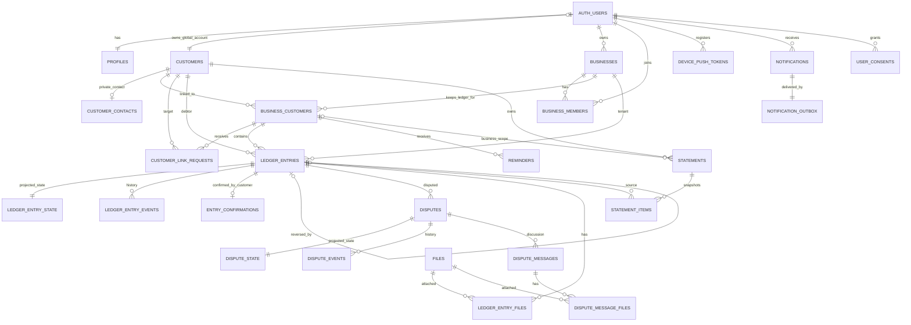

# ERD — Debt Ledger MVP

## Relationship rules

- A Supabase Auth user can be a merchant, customer, or both.
- Every registered user gets one global `customers` row; unregistered customers also get a row with `user_id = null`.
- `business_customers` is the tenant-safe bridge. A merchant only sees rows for their business; a customer sees linked rows belonging to their global account.
- `ledger_entries` is append-only. Reversal is a new entry pointing to `reversal_of_entry_id`.
- Confirmation, dispute, and reversal history are never overwritten; projection tables exist only for fast UI reads.
- Phone data is not stored in `public`; encrypted phone ciphertext and HMAC lookup values live in `private.customer_contacts`.
