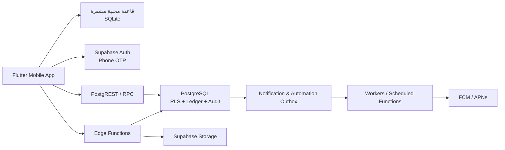
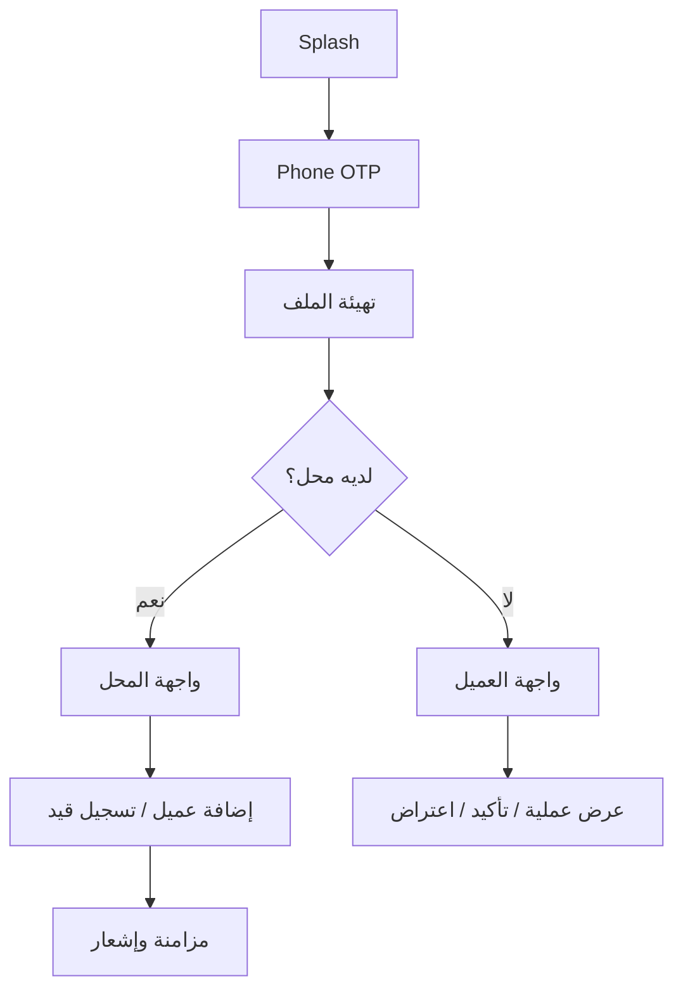
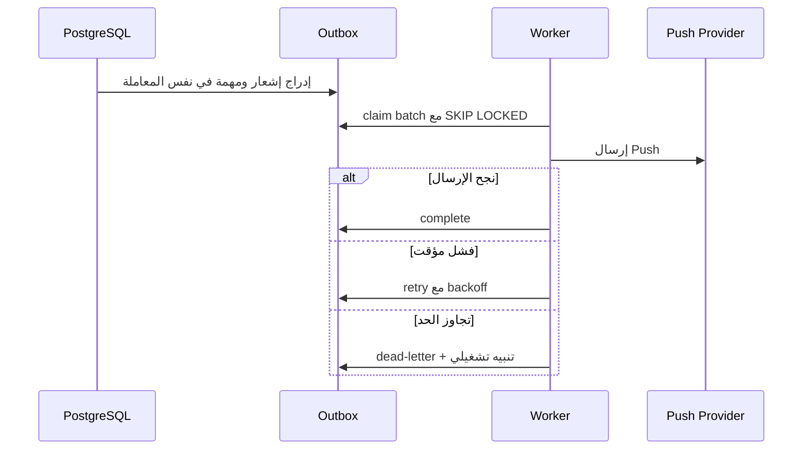

# المواصفة المرجعية للنسخة الأولى — دفتر الديون الموثوق

> **الحالة:** وثيقة تحليل وتصميم مرجعية  
> **الإصدار:** 1.0  
> **المنصة:** تطبيق Flutter واحد (Android أولاً، ثم iOS) + Supabase  
> **أسلوب التشغيل:** Offline-first مع مزامنة آمنة عند عودة الإنترنت

## 1. الغرض من الوثيقة

هذه الوثيقة هي مرجع القرار والتصميم والتنفيذ للنسخة الأولى من التطبيق. تستخدمها فرق المنتج، التصميم، Flutter، الخلفية، الاختبار والتشغيل لتحديد ما يبنى، وكيف يعمل، وما لا يدخل في الإطلاق الأول.

المستودع يحتوي حالياً على أساس قاعدة بيانات Supabase ووثائق المنتج. هذه الوثيقة تربط ذلك الأساس بتطبيق قابل للبناء والإطلاق، وتحدد الإضافات المطلوبة للوصول إلى منتج مكتمل.

## 2. تعريف المنتج

دفتر الديون الموثوق هو تطبيق جوال للمحلات والعملاء يحول الدين الورقي إلى سجل مالي شفاف. يسجل المحل الدين أو الدفعة، ويرى العميل العملية ويؤكدها أو يعترض عليها. لا تحذف القيود المالية ولا تعدل؛ التصحيح يتم بقيد عكسي موثق.

### 2.1 المشكلة

- الدفاتر الورقية معرضة للضياع، الخطأ والخلاف.
- العميل لا يرى عملياته فوراً ولا يمتلك دليلاً موحداً.
- المحل لا يملك تذكيرات منظمة أو كشف حساب قابل للتحقق.
- ضعف الإنترنت لا يجب أن يمنع المحل من تسجيل العملية.

### 2.2 القيمة الأساسية

| للمحل | للعميل | للمنصة |
|---|---|---|
| تسجيل سريع وآمن للديون والدفعات | رؤية واضحة لكل عملية مرتبطة به | تشغيل قابل للمراقبة والتوسع |
| رصيد وتحصلات وتذكيرات منظمة | تأكيد أو اعتراض موثق | بيانات معزولة وسجل تدقيق |
| كشف حساب رسمي | كشف موحد خاص به | تقليل النزاعات وفقدان البيانات |

### 2.3 مبادئ غير قابلة للتنازل

1. **الخادم هو الحقيقة المالية النهائية.** لا يحسب التطبيق الرصيد الرسمي ولا يحسم التعارض محلياً.
2. **القيود المالية append-only.** لا `UPDATE` ولا `DELETE` للقيد المالي.
3. **كل طلب مالي مقاوم للتكرار.** يستخدم مفتاح idempotency ثابتاً.
4. **الخصوصية قبل الراحة.** لا يرى العميل بيانات محل إلا بعد قبول الربط، ولا يرى المحل بيانات العميل لدى غيره.
5. **العمل دون اتصال لا يعني تجاوز القواعد.** تحفظ العملية محلياً وتصبح رسمية فقط بعد قبول الخادم لها.
6. **الأتمتة تتابع ولا تتخذ قراراً مالياً.** لا تنشئ ديناً ولا تغير رصيداً من تلقاء نفسها.

## 3. نطاق النسخة الأولى

### 3.1 داخل النطاق

- التسجيل وتسجيل الدخول برقم الهاتف OTP.
- حساب واحد يمكن أن يكون صاحب محل وعميل في آن واحد.
- إنشاء محل وعملة واحدة لكل محل.
- إضافة عميل محلي، والبحث الآمن بالهاتف، وطلب ربط الحساب.
- تسجيل رصيد افتتاحي، دين، دفعة وقيد عكسي.
- عرض الرصيد والسجل الزمني لكل عميل.
- تأكيد العميل للعملية أو فتح اعتراض ومراسلة المحل.
- مرفقات للعمليات والاعتراضات.
- إشعارات داخل التطبيق وPush عند توفر الإنترنت.
- تذكير يدوي وقواعد تذكير تلقائية أولية.
- كشف حساب لمحّل واحد وكشف موحد خاص بالعميل، مع PDF ورمز تحقق.
- تشغيل أساسي دون إنترنت، ومزامنة لاحقة.
- العربية وRTL أولاً، مع إنجليزية اختيارية.

### 3.2 خارج النطاق

- المخزون ونقطة البيع والفواتير الضريبية.
- الدفع الإلكتروني وربط البنوك.
- تعدد العملات داخل المحل أو فروع متعددة.
- WhatsApp/SMS جماعي مدفوع.
- تقييم ائتماني مشترك أو مشاركة سمعة العملاء.
- ذكاء اصطناعي، تقارير متقدمة، وخطط تقسيط معقدة.
- لوحة إدارة ويب كاملة؛ تؤجل حتى بعد التجربة المغلقة.

## 4. المستخدمون والصلاحيات

| الدور | الصلاحيات |
|---|---|
| `owner` | إدارة المحل والموظفين، جميع الأوامر المالية، الإعدادات |
| `admin` | كـ owner ما عدا نقل الملكية |
| `accountant` | القيود، القيد العكسي، الاعتراضات والكشوف |
| `cashier` | تسجيل دين ودفعة فقط |
| `collector` | التذكيرات ورسائل الاعتراض فقط |
| `viewer` | قراءة فقط |
| العميل | قراءة سجلاته المرتبطة، التأكيد، الاعتراض، الكشوف الخاصة |
| مدير المنصة | تشغيل ودعم ومراقبة، من دون تعديل الأرصدة مباشرة |

## 5. المعمارية المستهدفة



### 5.1 مسؤوليات الطبقات

| الطبقة | المسؤولية |
|---|---|
| Flutter | الواجهة، التحقق المحلي البسيط، التخزين المحلي، queue والمزامنة |
| SQLite محلية | cache مشفر، أوامر معلقة، مرفقات معلقة، cursor للمزامنة |
| PostgreSQL | الحقيقة المالية، المعاملات، RLS، الأحداث، التدقيق |
| RPC | أوامر الأعمال الذرية فقط |
| Edge Functions | الهاتف المشفر، رفع الملفات، PDF، workers، التحقق العام |
| Storage | المرفقات الخاصة وPDF والصور |
| Worker | التسليم، إعادة المحاولة، الأتمتة، التنظيف المجدول |

## 6. هيكل مستودع التطبيق

```text
mobile/
├── lib/
│   ├── main.dart
│   ├── app/                    # bootstrap, routing, theme, i18n
│   ├── core/                   # auth, api, sqlite, sync, errors, security
│   ├── features/
│   │   ├── authentication/
│   │   ├── onboarding/
│   │   ├── profile/
│   │   ├── business/
│   │   ├── members/
│   │   ├── customers/
│   │   ├── customer_linking/
│   │   ├── ledger/
│   │   ├── confirmations/
│   │   ├── disputes/
│   │   ├── reminders/
│   │   ├── statements/
│   │   ├── attachments/
│   │   ├── notifications/
│   │   └── settings/
│   └── shared/                 # design system, models, constants
├── assets/                     # fonts, images, translations
├── test/
└── integration_test/

supabase/
├── migrations/
├── functions/
├── tests/
├── seed.sql
└── config.toml
```

كل feature في Flutter تتبع هذا التقسيم:

```text
feature/
├── presentation/  # pages, widgets, state management
├── application/   # use cases
├── domain/        # entities and business rules
└── data/          # Supabase, SQLite, repositories
```

## 7. تجربة المستخدم والتنقل

### 7.1 التدفق العام



### 7.2 تبويبات المحل

1. الرئيسية: إجمالي المستحقات، المتأخرات، ما يحتاج متابعة، آخر العمليات.
2. العملاء: بحث، فلاتر، رصيد، حالة الربط.
3. إضافة: دين أو دفعة.
4. العمليات: سجل موحد مع فلاتر.
5. المزيد: اعتراضات، تذكيرات، كشوف، موظفون، إعدادات.

### 7.3 تبويبات العميل

1. الرئيسية: عمليات تحتاج مراجعة وإجمالي الالتزامات.
2. المحلات: المحلات المرتبطة فقط.
3. العمليات: كل القيود المصرح بها.
4. الإشعارات.
5. حسابي: الملف، الخصوصية، الأجهزة والموافقات.

### 7.4 حالات العرض المشتركة

- تحميل، فارغ، خطأ، بلا إنترنت، صلاحية مرفوضة، حساب موقوف.
- حالة مزامنة ظاهرة لكل قيد: `synced` أو `pending_sync` أو `rejected`.
- لا يظهر نجاح نهائي للعملية المحلية قبل إقرار الخادم.

## 8. العمليات التجارية الأساسية

### 8.1 التهيئة وتسجيل الحساب

1. يرسل المستخدم الهاتف إلى Auth.
2. يتحقق OTP.
3. ينشئ trigger ملف `profiles` وسجل `customers` موحداً.
4. تستدعى `bootstrap-user-contact` لحفظ HMAC وتشفير الهاتف.
5. يختار المستخدم بياناته الأساسية والدور الأولي.

### 8.2 إنشاء محل

1. المالك يدخل الاسم والنشاط والعملة والمدينة.
2. يستدعي التطبيق `create_business`.
3. تنشأ `businesses` وعضوية `owner` في معاملة واحدة.
4. ينشئ التطبيق cache محلياً للمحل.

### 8.3 إضافة عميل وربطه

**عميل مسجل:**

1. المحل يدخل الهاتف.
2. تستدعى `customer-directory` بعد تحقق عضوية المحل ومعدل الطلبات.
3. تنشأ `business_customers` بحالة `pending`.
4. يرسل `request_customer_link` إشعاراً للعميل.
5. يقبل العميل أو يرفض؛ لا يرى البيانات قبل القبول.

**عميل غير مسجل:**

1. تنشئ Edge Function سجلاً `customers` من دون `user_id` وبيانات اتصال مشفرة.
2. ينشئ المحل السجل المحلي ويستطيع تسجيل القيود.
3. عند التسجيل مستقبلاً بنفس الهاتف، تنفذ عملية مطابقة وموافقة صريحة.

### 8.4 تسجيل دين أو دفعة

1. يختار الموظف العميل ويدخل المبلغ والوصف وتاريخ الاستحقاق.
2. يولد التطبيق `idempotency_key` و`device_id` قبل الحفظ.
3. عند الاتصال، يستدعي `create_ledger_entry`; وعند الانقطاع يحفظ command محلياً.
4. يتحقق الخادم من الدور، المحل، العميل، العملة، الرصيد وحد الائتمان.
5. ينشئ القيد والحالة والأحداث والإشعار في معاملة واحدة.
6. ينفذ Worker الإشعار؛ تظهر العملية للعميل بعد نجاح التسجيل في الخادم.

### 8.5 القيد العكسي

1. لا يوجد زر حذف أو تعديل مبلغ.
2. صاحب الصلاحية يختار “عكس العملية” ويكتب سبباً إلزامياً.
3. يستدعي `reverse_ledger_entry`.
4. ينشئ الخادم قيداً معاكساً بالمبلغ والعملة نفسيهما ويربطه بالأصل.
5. يتغير العرض إلى “تم عكسها” مع بقاء التاريخ كاملاً.

### 8.6 تأكيد العميل

1. يفتح العميل العملية بعد قبول الربط.
2. يضغط تأكيد.
3. تستدعى `confirm_ledger_entry`.
4. يمنع الخادم التأكيد المكرر أو التأكيد إذا كان اعتراض فعالاً.
5. ينشأ تأكيد وحدث وإشعار للمحل.

### 8.7 الاعتراض وحله

1. يفتح العميل اعتراضاً بسبب محدد ووصف ومرفق اختياري.
2. تصبح الحالة `awaiting_merchant` وتصل رسالة للمحل.
3. يتبادل الطرفان الرسائل ضمن اعتراض مفتوح فقط.
4. المحل يرفض، يقبل كلياً، أو يقبل جزئياً.
5. القبول الكامل ينشئ قيداً عكسياً؛ والجزئي ينشئ عكساً ثم قيداً مصححاً.
6. بعد الحالة النهائية لا يسمح بمراسلات تعيد فتح الاعتراض.

### 8.8 كشف الحساب

1. يحدد المستخدم النطاق والفترة.
2. تتحقق `generate-statement` من الصلاحية.
3. تنشئ snapshot ذرية: الرصيد الافتتاحي والحركات والرصيد الختامي.
4. يولد PDF ويحفظ في bucket خاص مع SHA-256 ورمز تحقق.
5. يرجع رابط signed قصير العمر.
6. `verify-statement` العام يعرض بيانات محدودة غير شخصية فقط.

## 9. Offline-first والمزامنة

### 9.1 ما يعمل دون إنترنت

- فتح التطبيق بعد تسجيل سابق.
- قراءة البيانات المزامنة سابقاً.
- إنشاء دين ودفعة وقيد عكسي كأوامر معلقة.
- التقاط المرفقات وتجهيزها.
- مراجعة كشف محفوظ محلياً.

### 9.2 ما يتطلب الاتصال

- OTP لأول دخول أو تجديد ضروري للجلسة.
- البحث عن مستخدم جديد بالهاتف والربط.
- ظهور عملية لطرف آخر أو إرسال إشعار.
- التحقق النهائي من قيد أو دفع أو حل اعتراض.
- PDF جديد والنسخ الاحتياطي.

### 9.3 جداول SQLite المحلية

```text
cached_businesses
cached_business_customers
cached_ledger_entries
cached_disputes
cached_notifications
pending_commands
pending_attachments
sync_metadata
sync_conflicts
local_audit_log
```

### 9.4 سجل الأوامر المحلي

```text
pending_commands
- id
- device_id
- command_type
- idempotency_key
- payload_json
- local_created_at
- status: queued | sending | synced | rejected | conflict
- retry_count
- last_error
- server_result_json
```

### 9.5 قواعد المزامنة

1. يعاد إرسال نفس `idempotency_key` دائماً.
2. يحتفظ الخادم بـ receipt لكل أمر ويعيد النتيجة السابقة للطلب المكرر.
3. الخادم يرفض ما يخالف القواعد، ولا يحل التطبيق التعارض المالي بنفسه.
4. يظهر الرفض بوضوح مع إجراء للمستخدم.
5. يرفع المرفق بعد قبول العملية أو باستخدام مرجع آمن للعملية المعلقة.
6. المزامنة تسحب تغييرات الخادم عبر cursor، لا عبر تحميل كامل متكرر.

## 10. قاعدة البيانات السحابية

### 10.1 الجداول الحالية التي تبقى

| النطاق | الجداول |
|---|---|
| الهوية | `profiles`, `customers`, `private.customer_contacts`, `user_consents`, `device_push_tokens` |
| المستأجرون | `businesses`, `business_members`, `business_customers`, `customer_link_requests` |
| الدفتر | `ledger_entries`, `ledger_entry_state`, `ledger_entry_events`, `entry_confirmations` |
| الاعتراض | `disputes`, `dispute_state`, `dispute_events`, `dispute_messages` |
| الملفات | `files`, `ledger_entry_files`, `dispute_message_files` |
| الإشعارات | `notifications`, `private.notification_outbox`, `reminders` |
| الكشوف والتدقيق | `statements`, `statement_items`, `private.audit_logs` |

### 10.2 الجداول الواجب إضافتها

| الجدول | الغرض |
|---|---|
| `business_member_invites` | دعوة الموظفين وقبولها وانتهاؤها |
| `business_settings` | إعدادات المحل الثابتة وسياسات العمل |
| `business_automation_settings` | ساعات وقنوات وقواعد التذكير |
| `automation_rules` | قواعد الأتمتة المفعلة لكل محل |
| `automation_runs` | تنفيذ القواعد، منع التكرار، النتائج |
| `notification_delivery_attempts` | سجل كل محاولة إرسال ومزودها |
| `dead_letter_jobs` | مهام فشلت بعد حد المحاولات |
| `device_installations` | أجهزة التطبيق والمفاتيح وحالة الإبطال |
| `command_receipts` | نتيجة أوامر offline/idempotency |
| `sync_checkpoints` | cursor آخر مزامنة لكل جهاز/محل |
| `dispute_sla` | مهلة الرد والتصعيد |
| `security_events` | أحداث حساسة: تغيير هاتف، إبطال جهاز، حظر |

### 10.3 قواعد البيانات الحرجة

- `ledger_entries` وevents والتأكيدات وitems غير قابلة للتعديل أو الحذف.
- رصيد العميل يشتق من القيود ولا يحفظ كرقم قابل للتحرير.
- يستعمل `numeric(20,4)` للمبالغ؛ لا `double` أو `float`.
- كل قيد ينتمي إلى محل وعميل محلي وعميل عالمي متطابقين.
- لا تظهر قيود العميل له قبل أن تكون علاقة المحل/العميل `linked`.
- كل أمر مالي يعيد النتيجة السابقة إذا وصل بالمفتاح نفسه.
- لا يسمح برسالة أو تغيير حالة اعتراض بعد وضعه في حالة نهائية.

## 11. واجهة الأوامر والخدمات

### 11.1 RPC المتاحة للتطبيق

```text
create_business
invite_business_member
respond_business_member_invite
add_business_customer
request_customer_link
respond_link_request
create_ledger_entry
reverse_ledger_entry
confirm_ledger_entry
open_dispute
add_dispute_message
resolve_dispute
create_reminder
mark_notification_read
```

### 11.2 Edge Functions

| الدالة | المهمة |
|---|---|
| `bootstrap-user-contact` | تشفير وتجزئة هاتف المستخدم بعد OTP |
| `customer-directory` | بحث أو إنشاء عميل مع rate limit وصلاحية المحل |
| `signed-document-upload` | رابط رفع مؤقت وآمن |
| `finalize-document-upload` | فحص الملف وتسجيل metadata وربطه بالكيان |
| `process-notification-outbox` | إرسال Push وإدارة retries والتوكنات التالفة |
| `process-automation-rules` | تنفيذ التذكيرات والتصعيدات المجدولة |
| `generate-statement` | إنشاء snapshot وPDF ورابط signed |
| `verify-statement` | تحقق عام محدود من رمز الكشف |
| `cleanup-expired-data` | إغلاق روابط ومهام منتهية وتنظيف آمن |

## 12. الأتمتة

### 12.1 دورة الإشعار



### 12.2 قواعد أولية

| القاعدة | الشرط | الإجراء | الإيقاف |
|---|---|---|---|
| قبل الاستحقاق | قبل الموعد بـ3 أيام | Push لطيف | دفع كامل أو اعتراض مفتوح |
| يوم الاستحقاق | اليوم = due date | Push | دفع أو إلغاء القاعدة |
| تأخر 3 أيام | رصيد موجب ومتأخر | تذكير متدرج | دفع/اعتراض/إلغاء موافقة |
| اعتراض متأخر | بلا رد من المحل | تنبيه لصاحب المحل | رد أو حل |
| فشل Worker | تجاوز retries | alert للمنصة | معالجة يدوية |

## 13. الأمان والخصوصية

- Auth OTP، جلسات قصيرة، وإبطال الأجهزة عند الحاجة.
- RLS مفعل على كل جدول في `public`، وdefault deny للصلاحيات.
- service-role داخل Edge Functions فقط، ولا يرسل إلى التطبيق.
- HMAC للهاتف للبحث، وتشفير AES-GCM للعرض/الاسترجاع الخدمي فقط.
- روابط storage موقعة وقصيرة العمر.
- تشفير SQLite محلياً؛ مفتاحها في Android Keystore أو iOS Keychain.
- لا تسجل أرقام هاتف أو OTP أو tokens أو محتويات حساسة في logs.
- Rate limiting لطلب OTP، دليل العملاء، التحقق من الكشوف والرفع.
- سجل تدقيق لكل تغيير في حالات الأعمال والإدارة.

## 14. المراقبة والتشغيل

### 14.1 مؤشرات يجب قياسها

- نسبة نجاح المزامنة ومدة queue.
- عدد القيود المكررة الممنوعة.
- معدل نجاح Push وإعادة المحاولات وdead letters.
- متوسط وقت حل الاعتراض.
- نسبة عمليات العميل المؤكدة أو المعترض عليها.
- عدد المحلات النشطة والعمليات لكل محل.
- نسبة السداد بعد التذكير.
- أخطاء Flutter وEdge Functions وقاعدة البيانات.

### 14.2 تنبيهات تشغيلية

- Worker لا يعالج outbox لمدة 10 دقائق.
- dead-letter يتجاوز حدّاً يومياً.
- فشل توليد كشف أو رفع مرفق.
- ارتفاع أخطاء RLS أو rate-limit.
- فرق غير متوقع بين cache محلي ونتيجة خادم بعد المزامنة.

## 15. الاختبارات ومعايير القبول

### 15.1 اختبارات الخلفية

- RLS: لا وصول عابر بين المحلات أو العملاء.
- Ledger: لا تعديل ولا حذف ولا قيد مكرر.
- Idempotency: إعادة نفس الطلب تعيد نفس النتيجة.
- Concurrency: قيدان متزامنان لا يكسران حد الائتمان أو الرصيد.
- Disputes: لا إعادة فتح بعد الحالة النهائية.
- Statements: snapshot صحيح ولا يراه محل آخر.
- Storage: لا تحميل أو قراءة من دون metadata مصرح بها.

### 15.2 اختبارات Flutter

- RTL والأرقام العربية والإنجليزية.
- عملية دين بلا إنترنت ثم مزامنة واحدة فقط.
- توقف التطبيق أثناء الإرسال ثم استئناف آمن.
- عرض سبب الرفض وإعادة المحاولة.
- عدم عرض الرصيد المؤقت كرصد رسمي.
- مسح بيانات الجهاز عند إبطال جلسة/جهاز.

### 15.3 معايير قبول الإطلاق المغلق

1. لا يوجد تكرار لقيود مالية في اختبار الانقطاع.
2. لا يستطيع مستخدم رؤية بيانات خارج صلاحياته.
3. القيد العكسي يطابق الأصل تماماً.
4. الإشعارات تفشل بأمان وتُعاد محاولتها.
5. كشف الحساب قابل للتحقق ولا يكشف بيانات شخصية للعامة.
6. يستطيع صاحب المحل إتمام مسار: عميل → دين → عميل يؤكد/يعترض → كشف.

## 16. خطة التنفيذ

### المرحلة 0 — تثبيت الأساس (أسبوعان)

- تهيئة مشروع Flutter وSupabase CLI وبيئات dev/staging/prod.
- إصلاح قواعد RLS للربط قبل العرض.
- تطبيق idempotency receipts وحماية حالات الاعتراض النهائية.
- إضافة pgTAP واختبارات migrations وRLS.

### المرحلة 1 — جوهر المحل (3–4 أسابيع)

- OTP، الملف، إنشاء المحل، العملاء، الرصيد.
- تسجيل الدين والدفعة والقيد العكسي.
- SQLite محلية وqueue ومزامنة أساسية.

### المرحلة 2 — الثقة والتواصل (3 أسابيع)

- الربط، التأكيد، الاعتراضات، المرفقات.
- Push وoutbox worker وإدارة retries.

### المرحلة 3 — التحصيل والكشوف (2–3 أسابيع)

- التذكيرات وقواعد الأتمتة الأولى.
- PDF، الكشوف، والتحقق العام.

### المرحلة 4 — التجربة المغلقة (2–4 أسابيع)

- 5 إلى 10 محلات في منطقة واحدة.
- مراقبة يومية، إصلاحات، وقياس مؤشرات الثقة والتحصيل.

## 17. قرارات معتمدة

| القرار | النتيجة |
|---|---|
| تطبيق Flutter واحد | تكلفة أقل وتجربة موحدة للمحل والعميل |
| Android أولاً | أسرع للوصول إلى الشريحة المستهدفة |
| Offline-first | استمرار التسجيل مع ضمان أن الخادم يحسم النتيجة |
| Supabase + PostgreSQL | معاملات مالية، RLS، Auth وStorage ضمن منصة واحدة |
| Modular monolith | أسرع وأقل تعقيداً من microservices للنسخة الأولى |
| عملة واحدة لكل محل | يزيل تعقيد التحويل والتقارير متعدد العملات |
| لا حذف للقيود | أساس الثقة وسجل التدقيق |

## 18. مخاطر يجب إدارتها

| الخطر | التخفيف |
|---|---|
| إدخال مكرر عند ضعف الشبكة | idempotency + command receipts |
| تعارض أجهزة المحل بلا إنترنت | الخادم مرجع نهائي وواجهة تعارض واضحة |
| إساءة استعمال البحث بالهاتف | HMAC + rate limit + تحقق عضوية المحل |
| فقدان جهاز | تشفير محلي، إبطال جهاز، جلسات آمنة |
| فشل Push | outbox وbackoff وdead-letter |
| نزاع حول عملية | تأكيد، اعتراض، أحداث ثابتة، قيد عكسي |
| تضخم النطاق | التزام صارم بقسم خارج النطاق حتى نجاح التجربة |

## 19. تعريف الإنجاز للنسخة الأولى

تعد النسخة الأولى جاهزة للتجربة المغلقة عندما يستطيع صاحب محل مسجل إضافة عميل، تسجيل دين أو دفعة بلا إنترنت، مزامنتها بأمان، إشعار العميل عند توفر الاتصال، وتمكين العميل من التأكيد أو الاعتراض، ثم إصدار كشف حساب موثق؛ مع إثبات آلي أن الصلاحيات والرصيد وعدم التكرار تعمل بصورة صحيحة.
